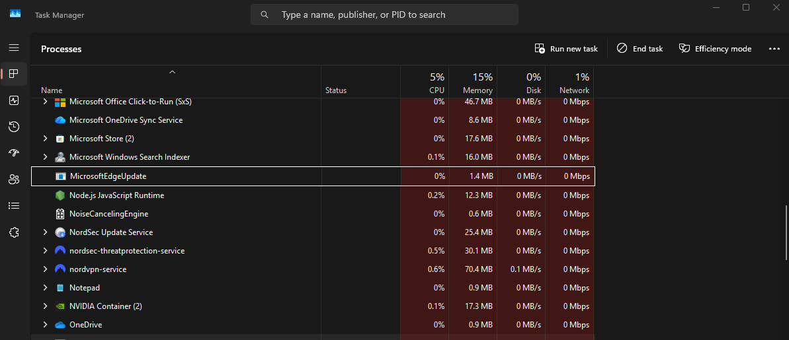

# Stealing Azure Tokens Without Touching the Network

*May 5, 2026*

## Persistent Tokens

Organisations spend enormous effort hardening authentication. Multi-factor authentication (MFA) is now standard. Password complexity policies are enforced. NTLM is being phased out. The implicit assumption behind all of this is that the attacker is trying to get your password — when in fact, they don't need it.

Modern enterprise identity is built on OAuth 2.0 Bearer tokens. Think of a Bearer token like a wristband at a concert. Once you've shown your ticket and ID at the door (your password and MFA code), you get a wristband. From that point on, nobody checks your ID again — they just check the wristband. If someone steals your wristband, they can walk back in as you.

When a user signs into Microsoft 365 via Entra ID (formerly Azure Active Directory), Windows doesn't just validate their credentials and forget them. It saves the resulting tokens — access tokens, refresh tokens, and session cookies — directly to disk, protected with a Windows encryption mechanism tied to that user account. Those tokens are valid for hours or days. They bypass MFA entirely, because MFA already happened. *They work from any IP address.* They don't generate password spray alerts.

Every Windows machine where a user has ever signed into Teams, Outlook, the Azure portal, or the Azure CLI is carrying these tokens right now.

This post covers how we built **entra_reaper**: a lightweight, fileless tool (called a BOF) that harvests Entra ID token caches, decrypts them, and returns the raw tokens to the attacker — all without spawning a new process or touching the network.

## How This Attack Starts: Initial Access

Before any token theft can occur, the attacker needs to be running code on the victim's machine. In this scenario, that starts with a phishing email.

A convincing email arrives - perhaps impersonating an IT helpdesk, a delivery notification, or an internal HR update. The victim clicks a link or opens an attachment, which executes a file in the background. In our example, the file that gets executed, is a C2 agent: a small program that quietly connects back to the attacker's server and waits for instructions. From this point on, the attacker can issue commands to the victim's machine remotely without the victim being aware.

The agent disguises itself with a legitimate-sounding process name - in this case, `MicrosoftEdgeUpdate.exe`. This is a process that would normally appear on any Windows machine, making it much less likely to raise suspicion.

With this foothold established, the attacker can now run specialised tools against the machine. One of those tools is `entra_reaper`.


*The moment the agent connects back to the attacker's server. Note the process name — from here, the attacker has full remote control of the victim machine.*

## What Is a BOF?

Traditional post-exploitation tools are standalone executables or scripts. They can be easy to detect: a new process appears in the task manager, a new file lands on disk, Windows logging systems fire alerts.

A BOF (Beacon Object File) is a different model. Rather than being a complete program, it is a small bundle of compiled code that gets injected directly into the memory of the already-running agent, executes its task, and is then discarded. No new process, no new file on disk.

Attacker > remote server > agent (MicrosoftEdgeUpdate.exe)

- loads entra_reaper into its own memory
- runs the harvesting code
- sends results back
- removes itself from memory

From Windows' perspective, the entire credential harvest happened *inside* `MicrosoftEdgeUpdate.exe` — a process that was already running and already trusted. This makes it significantly harder for security software to detect compared to a traditional tool.

**In plain English:** a BOF is like a spy who borrows someone else's badge to enter a building, does their job, and leaves — rather than signing in at reception under their own name.

## What entra_reaper Targets

Windows stores Entra ID tokens in several locations, each used by a different Microsoft product. All of them are on disk, and all of them are protected using a Windows feature called DPAPI.

| Store | Used By |
|---|---|
| **TokenBroker cache** | Office 365, Entra sign-in, Windows account |
| **IdentityCache** | Teams, Outlook, Azure portal |
| **Azure CLI session** | The `az` command-line tool |
| **Azure PowerShell** | The `Az` PowerShell module |
| **Legacy Azure CLI** | Older CLI versions (sometimes stored as plain text) |

### Why Windows Encryption Is Not a Barrier Here

DPAPI (Data Protection API) is Windows' built-in system for encrypting secrets stored on disk. When Teams or the Azure CLI want to save a token, they use DPAPI to lock it. When they want it back, they use DPAPI to unlock it.

The critical detail: the encryption key is derived from the *currently logged-in user's* credentials. This means any program running as that user can ask Windows to decrypt those files — no password prompt, no admin rights needed.

```c
// Any process running as the user can call this and get the token back.
// Windows just checks: are you running as this user? Yes? Here you go.
CryptUnprotectData(&encrypted, NULL, NULL, NULL, NULL, 0, &plaintext);
```

**In plain English:** DPAPI is like a safe that only opens when you're holding the right house key — but in this case, any program that's running under your Windows account *already has a copy of that key*. It's not a flaw; it's how the system is designed to work. The assumption is that if code is running as you, it is you.

## How entra_reaper Works

Once injected into the agent process, `entra_reaper` runs through three steps:

**1. Locate the token files**
The BOF searches the known file paths for each token store. It walks directories looking for `.tbres`, `.bin`, and `.dat` files — the same files that Teams and Outlook access every day.

**2. Decrypt in memory**
For each file found, the BOF calls the Windows DPAPI decryption function inline, within the agent's own process memory. The decrypted content is JSON — structured data containing the token strings.

**3. Extract and return**
The BOF parses the JSON to pull out access tokens, refresh tokens, and relevant metadata (audience, expiry, user UPN), then returns the formatted output to the attacker's server via the normal C2 channel.

The entire process takes approximately two seconds and produces around 267 KB of output. There is no network connection to Microsoft, no new file written to disk, and no new process created at any point.


*The BOF executing inline inside the agent — no new process created, results returned within seconds.*


*A sample of the harvested token data. Each entry contains everything needed to impersonate the user across Microsoft services.*

## What Attackers Do With the Tokens

Stolen Bearer tokens are immediately usable. No cracking, no further exploitation required — they are the credential.

### Accessing Microsoft 365 (Email, Files, Teams)

Microsoft Graph is the API that underpins all Microsoft 365 services. An attacker with a valid access token can read the victim's emails, download files from SharePoint and OneDrive, read Teams conversations, and enumerate the entire user directory of the organisation.

```bash
# Read the victim's emails
curl -H "Authorization: Bearer eyJ0eXAiOiJKV1Qi..." \
     https://graph.microsoft.com/v1.0/me/messages

# List all users in the organisation
curl -H "Authorization: Bearer ..." \
     https://graph.microsoft.com/v1.0/users
```

No login prompt. No MFA. Just the token and an API call.


*A Microsoft Graph API call succeeding with a stolen token. The victim's mailbox data is returned with no authentication prompt.*

### Azure Cloud Access

Token caches frequently contain tokens for Azure Resource Manager — the service behind the Azure portal. If the compromised user has Azure permissions, the attacker inherits them entirely. They can list subscriptions, inspect infrastructure, and potentially deploy or destroy cloud resources, all without generating a sign-in event.

### Refresh Tokens: Long-Term Persistence

This is where the attack becomes particularly dangerous. Access tokens expire in roughly 60 minutes — but refresh tokens can survive for 24 hours to 90 days depending on how the organisation's policies are configured.

A refresh token can be silently exchanged for a new access token at any time, with no user interaction and no MFA prompt. This means an attacker who steals a refresh token has persistent access to that user's identity for as long as the token remains valid, even if the original access token has long since expired.

```python
# A stolen refresh token can be exchanged for a fresh access token at any time
resp = requests.post("https://login.microsoftonline.com/<tenant>/oauth2/v2.0/token", data={
    "grant_type":    "refresh_token",
    "client_id":     "<app_id>",
    "refresh_token": stolen_refresh_token,
    "scope":         "https://graph.microsoft.com/.default"
})
new_access_token = resp.json()["access_token"]
```

This exchange does generate an entry in Entra audit logs, but it appears identical to a normal token refresh from a legitimate application. There is no "suspicious token use" alert in default configurations.

### Primary Refresh Tokens: Bypassing the Hardware Lock

Modern Windows devices use a more powerful credential type called a Primary Refresh Token (PRT). Unlike a standard refresh token, a PRT is hardware-bound — it is tied to the physical device using a TPM chip, which is meant to prevent it from being exported and used elsewhere.

However, an attacker with code execution on the device can abuse the local Windows Account Manager (WAM) service to use the PRT *from within the device itself*. The result is an `ESTSAUTHPERSISTENT` browser cookie — a session cookie that works in any browser, on any machine, until it expires. Once this cookie is generated, the hardware binding is effectively bypassed: the attacker can inject it into a browser on their own machine and access any Microsoft web service as the victim, with no MFA prompt.

**In plain English:** the PRT is like a master keycard that's chipped so it only works when it's physically present. The attack here doesn't steal the keycard — it *borrows* the reader, generates a paper copy of the access it grants, and then uses that paper copy from anywhere.

## MFA Was Already Satisfied

This is the key point that often surprises people outside the security industry: **MFA does not protect against token theft**.

MFA is a challenge issued at sign-in time — "prove you are who you say you are." Once the user proves their identity, a token is issued as proof of that verification. From that point on, the token is the credential. Whoever holds it has the access — whether that is the legitimate user or an attacker who stole it.

Stealing tokens is not breaking MFA. It is operating entirely after MFA has already done its job.

The only mechanism that can revoke a token mid-validity is CAE (Continuous Access Evaluation), which requires specific Entra configuration and is not enabled by default in most tenants.

## Why Catching the Malware Is Not Enough

Running `entra_reaper` takes approximately two seconds. The results are sent back to the attacker's server in the next check-in cycle. Even if the security software on the endpoint detects and kills the agent immediately after the BOF executes, the tokens have already left the machine.

This is an important shift in how to think about endpoint security. Detecting malware is critical — but a detection that happens five minutes after a two-second BOF has already run and reported back is not a successful defence of the tokens. The malware was stopped; the data was not.

**In plain English:** detecting the burglar after they've already taken the valuables and left is still useful — you know you were burgled — but it doesn't get the valuables back.

The controls that actually limit what an attacker can *do* with stolen tokens are not endpoint controls. They are identity and policy controls:

## Reducing the Blast Radius: What Actually Helps

### Conditional Access Policies
Entra Conditional Access can require that token use comes from a compliant, managed device. An attacker replaying a token from their own machine — or from a cloud server — will be blocked if the policy requires a healthy device posture. This is one of the most effective controls against token replay attacks.

### Continuous Access Evaluation (CAE)
CAE allows Microsoft services to revoke access tokens in near real-time when specific events occur (account disabled, password changed, IP address policy violation). Without CAE, an access token remains valid until it expires regardless of what happens to the account. With CAE, that window shrinks significantly.

### Short Token Lifetimes
Reducing access token lifetimes for sensitive applications limits the window of exposure. A token that expires in 15 minutes is significantly less useful to an attacker than one that expires in 60.

### Privileged Identity Management (PIM)
PIM requires privileged users to explicitly activate high-privilege roles for a limited time window, rather than holding them permanently. An attacker with a stolen token for a user who has no active privileged role assignment gets much less capability than one who inherits standing admin access.

### Phishing Awareness
All of the above controls reduce the *impact* of a successful compromise. Phishing awareness reduces the *probability* of one occurring in the first place. A user who recognises a phishing lure and reports it instead of clicking it does not become a foothold. Token harvesting is a post-exploitation technique — it only applies after the attacker is already inside. Regular, realistic phishing simulations are a meaningful control at the front door.

## The Bigger Picture

Password policies, MFA, and endpoint security are all necessary. None of them are sufficient alone.

An attacker who phishes a user, gains code execution, and runs a BOF like `entra_reaper` can walk out with tokens that:
- Bypass MFA
- Access email, SharePoint, Teams, and Azure infrastructure
- Remain valid for hours or days
- Are largely invisible in default sign-in logs

The defensive posture that reduces the blast radius of this scenario is not "better antivirus." It is a combination of identity-layer controls — Conditional Access, CAE, short token lifetimes, and PIM — that operate independently of whether the endpoint was compromised or caught.

EDR catches threats. Policies limit what caught and uncaught threats can do. Both matter.

## Conclusion

`entra_reaper` demonstrates that Bearer token theft is an accessible, no-elevation-required technique available to any attacker who achieves code execution on a Windows endpoint. The tokens are sitting on disk, encrypted with the user's own Windows key, and Windows provides the decryption function for free to any code running in that user's context.

The BOF execution model makes this particularly difficult for security tools to catch — no new process, no new file, the work happens inside an already-trusted process. Even if detection does occur, it may come too late to prevent the tokens from being exfiltrated.

The controls that actually limit attacker capability after a successful compromise are identity-layer controls: Conditional Access policies requiring device compliance, CAE for near-real-time revocation, token lifetime policies, and PIM for privileged access. These operate independently of whether the endpoint was ever caught.

EDR is a critical control. It is not a complete identity security strategy.

*This research was conducted for educational purposes and authorised security testing only. Techniques described should only be applied in environments where you have explicit written permission.*

**Tools referenced:**
- [Microsoft Entra ID (Azure Active Directory)](https://learn.microsoft.com/en-us/entra/identity/)
- [Microsoft Graph Explorer](https://developer.microsoft.com/en-us/graph/graph-explorer)
- [Conditional Access documentation](https://learn.microsoft.com/en-us/entra/identity/conditional-access/)
- [Continuous Access Evaluation](https://learn.microsoft.com/en-us/entra/identity/conditional-access/concept-continuous-access-evaluation)
- [Privileged Identity Management](https://learn.microsoft.com/en-us/entra/id-governance/privileged-identity-management/)
- [Havoc C2 Framework](https://github.com/HavocC2/Havoc)

**Related techniques:**
- MITRE ATT&CK T1550.001 — Use Alternate Authentication Material: Application Access Token
- MITRE ATT&CK T1555.003 — Credentials from Password Stores: Credentials from Web Browsers
- MITRE ATT&CK T1539 — Steal Web Session Cookie
