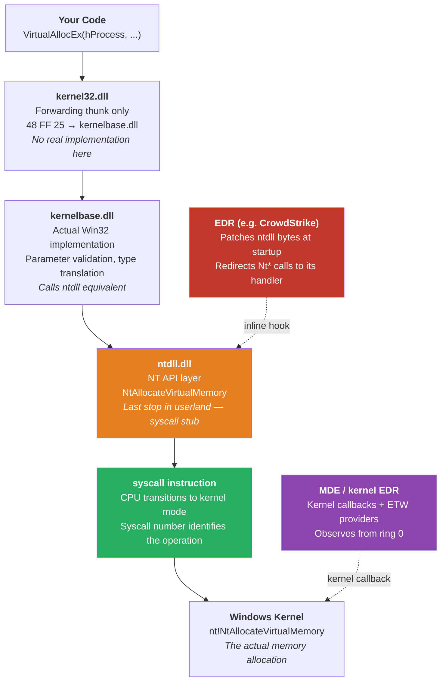
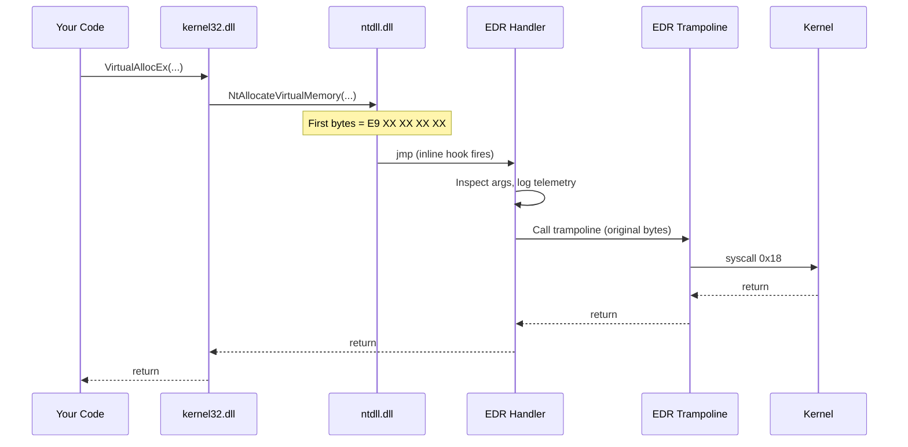

## Overview

When your code calls `VirtualAllocEx`, that single line sets off a chain of function calls descending through multiple DLL layers before it ever reaches the Windows kernel. Every layer in that chain is an opportunity for a security product to observe, intercept, or block the call.

This post traces that chain from top to bottom. By the end you will know exactly what an EDR does when it "hooks" an API — what that means technically, what the modified bytes look like in memory, and how to detect it.

**What this post covers:**
- The four-layer Windows API model: Win32 → kernelbase → NT API → syscall
- What forwarding thunks are and why kernel32 is mostly just jump tables
- How some EDRs use inline hooks at the ntdll layer
- The three most common hook patterns and what their bytes look like
- A C# tool that reads function prologues and detects hooks live
- What MDE actually hooks in practice — and why it is not what most people expect

---

## The Layered API Model

Windows API calls do not go directly to the kernel. They pass through a stack of DLL layers, each with a different role:



The layers:

| Layer | DLL | What it does |
|---|---|---|
| Win32 forwarding | `kernel32.dll` | Mostly forwarding thunks (`48 FF 25`) into kernelbase — no real code |
| Win32 implementation | `kernelbase.dll` | Actual parameter validation and translation; calls ntdll |
| NT API | `ntdll.dll` | Thin syscall stubs — loads SSN and executes `syscall` |
| Kernel | `ntoskrnl.exe` | The real implementation, running in ring 0 |

> **`kernel32.dll` is mostly a thunk layer.** Since Windows 7 the real Win32 implementations live in `kernelbase.dll`. `kernel32!VirtualAllocEx` is 7 bytes: `48 FF 25 XX XX XX XX` — a single `jmp [rip+offset]` into `kernelbase!VirtualAllocEx`. This matters for hook detection: checking `kernel32.dll` only tells you about the thunk, not the real function.

Some EDRs hook at the **ntdll layer** — the last userland stop before the kernel. Others operate entirely in kernel mode. Understanding the difference matters, because the technique used against one approach has no effect on the other.

---

## The ntdll Syscall Stub

`ntdll.dll` is the lowest userland DLL. Every Nt* function in it follows an identical pattern — a short stub that loads a hardcoded syscall number into `eax` and then executes the `syscall` instruction to drop to the kernel.

Here is `NtAllocateVirtualMemory` on a clean system (no EDR):

```
ntdll!NtAllocateVirtualMemory:
  4C 8B D1          mov r10, rcx       ; copy arg1 to r10 (syscall calling convention)
  B8 18 00 00 00    mov eax, 0x18      ; load SSN (Syscall Service Number)
  0F 05             syscall            ; transition to kernel mode
  C3                ret                ; return to caller
```

Only 11 bytes. No logic, no branching — it just loads a number and drops to the kernel. The `0x18` is the **Syscall Service Number (SSN)**: an index into the kernel's System Service Descriptor Table (SSDT) that maps to the actual kernel function.

The byte pattern for a clean ntdll stub is always:

```
4C 8B D1  B8 XX XX 00 00  0F 05  C3
```

The `XX XX` bytes vary per function (that is the SSN). Everything else is identical across all Nt* stubs.

This predictability is exactly what makes hook detection possible — and exactly what EDRs exploit.

---

## How EDRs Hook ntdll

When an EDR driver loads (at boot, before any user process starts), it maps a copy of ntdll and patches the first few bytes of selected functions. The patch overwrites the clean stub with a jump instruction that redirects execution to the EDR's own handler in its userland DLL.

**Before hooking — clean bytes:**

```
ntdll!NtAllocateVirtualMemory:
  offset +0:  4C 8B D1          mov r10, rcx
  offset +3:  B8 18 00 00 00    mov eax, 0x18
  offset +8:  0F 05             syscall
  offset +A:  C3                ret
```

**After hooking — patched by EDR:**

```
ntdll!NtAllocateVirtualMemory:
  offset +0:  E9 AB CD EF 12    jmp 0x7FF...     ; ← redirected to EDR trampoline
  offset +5:  00 00 00          (overwritten)
  offset +8:  0F 05             syscall          ; (never reached via normal path)
  offset +A:  C3                ret
```

The `E9` is a relative JMP. The EDR replaces the first 5 bytes of the stub with a jump to its own function. That function:
1. Logs the call and its arguments
2. Applies policy (allow / block / alert)
3. Jumps back to the original bytes (saved in a trampoline) to complete the call if allowed



The caller never knows the detour happened. From the perspective of your code the call completed normally — but the EDR has already logged it.

---

## The Three Common Hook Patterns

Different EDR products use different JMP variants. The three most common:

### Pattern 1: Relative JMP — `E9` (most common)

```
E9 XX XX XX XX    jmp <relative offset>
```

5 bytes. The target address is `current_address + 5 + offset`. Used by most commercial EDRs because it is compact.

### Pattern 2: Indirect JMP — `FF 25` (absolute pointer)

```
FF 25 XX XX XX XX    jmp [rip + offset]
```

6 bytes. Jumps to an address stored at `rip + offset`. Used when the EDR DLL is loaded far from ntdll in virtual address space (relative offsets would not reach).

### Pattern 3: MOV + JMP (absolute address, no indirection)

```
48 B8 XX XX XX XX XX XX XX XX    mov rax, <absolute addr>
FF E0                             jmp rax
```

12 bytes. Largest footprint, hardest to miss. Used by some older or simpler hooking implementations.

All three patterns overwrite the function prologue. All three are detectable by simply reading the first bytes of the function.

---

## Detecting Hooks: Reading Function Prologues

Hook detection does not require kernel access or special privileges. Every process can read its own memory with `ReadProcessMemory`. The approach:

1. Call `GetModuleHandle` to get the base address of the loaded DLL
2. Call `GetProcAddress` to get the address of each function to check
3. Read the first 16 bytes of that address
4. Compare byte[0] against known hook opcodes

```csharp
// Get the address of the function in the loaded DLL
IntPtr hModule  = GetModuleHandle("ntdll.dll");
IntPtr funcAddr = GetProcAddress(hModule, "NtAllocateVirtualMemory");

// Read its first 16 bytes
byte[] bytes = new byte[16];
int bytesRead;
ReadProcessMemory(GetCurrentProcess(), funcAddr, bytes, bytes.Length, out bytesRead);

// Check for the three common patterns
if (bytes[0] == 0xE9)
    Console.WriteLine("[HOOKED] Inline JMP (E9) detected");

else if (bytes[0] == 0xFF && bytes[1] == 0x25)
    Console.WriteLine("[HOOKED] Indirect JMP (FF 25) detected");

else if (bytes[0] == 0x48 && bytes[1] == 0xB8 && bytes[10] == 0xFF && bytes[11] == 0xE0)
    Console.WriteLine("[HOOKED] MOV RAX + JMP (48 B8..FF E0) detected");

else if (bytes[0] == 0x4C && bytes[1] == 0x8B && bytes[2] == 0xD1 && bytes[3] == 0xB8)
    Console.WriteLine("[CLEAN]  Native syscall stub (4C 8B D1 B8)");
```

A clean ntdll function always starts with `4C 8B D1 B8` — `mov r10, rcx; mov eax, <SSN>`. If the first bytes do not match that pattern, the stub has been modified.

Running this across all the security-sensitive Nt* functions maps out exactly what the EDR on that system is watching. Here is representative output from a system with an EDR that uses userland ntdll hooks:

```
[CLEAN]   ntdll!NtCreateFile            4C 8B D1 B8  ->  mov r10, rcx; mov eax, 0x55
[CLEAN]   ntdll!NtReadFile              4C 8B D1 B8  ->  mov r10, rcx; mov eax, 0x06
[HOOKED]  ntdll!NtAllocateVirtualMemory E9 AB CD EF  ->  jmp 0x7FFBCD123456
[HOOKED]  ntdll!NtWriteVirtualMemory    E9 12 34 56  ->  jmp 0x7FFBCD456789
[HOOKED]  ntdll!NtCreateThreadEx        E9 78 9A BC  ->  jmp 0x7FFBCD789012
[CLEAN]   ntdll!NtCreateKey             4C 8B D1 B8  ->  mov r10, rcx; mov eax, 0x1D
```

Products that use this approach (CrowdStrike Falcon, SentinelOne, Carbon Black) hook the injection-relevant ntdll functions and leave file and registry operations clean. That pattern immediately reveals what the EDR considers high-risk.

Now compare that to what MDE does.

---

## Seeing It Live: What MDE Actually Hooks

Running HookDetector on a Windows 11 system with the **Microsoft Defender for Endpoint** sensor active produces a result that contradicts the common assumption:


The summary:

```
[*] Total Functions Checked: 45
[!] HOOKED Functions: 6
[+] CLEAN Functions: 39
```

**The 6 hooked functions:**

```
[HOOKED] kernel32.dll!CreateFileA
         Type: Inline Hook (JMP Indirect)
         Bytes: FF 25 F2 28 03 00 ...
         ASM: jmp [rip+0x328F2]

[HOOKED] kernel32.dll!CreateFileW
         Type: Inline Hook (JMP Indirect)
         Bytes: FF 25 DA 28 03 00 ...
         ASM: jmp [rip+0x328DA]

[HOOKED] ntdll.dll!EtwEventWrite
         Bytes: 40 55 57 41 54 41 56 41 57 ...

[HOOKED] ntdll.dll!EtwEventWriteFull
         Bytes: 4C 8B DC 48 83 EC 58 ...

[HOOKED] ntdll.dll!EtwEventWriteTransfer
         Bytes: 40 55 57 41 54 41 55 41 57 ...

[HOOKED] ntdll.dll!LdrLoadDll
         Bytes: 4C 8B DC 49 89 5B 10 56 57 ...
```

And critically — all of these are **clean** (unmodified `4C 8B D1 B8` syscall stubs):

```
[CLEAN]  ntdll.dll!NtAllocateVirtualMemory   mov eax, 0x18
[CLEAN]  ntdll.dll!NtWriteVirtualMemory       mov eax, 0x3A
[CLEAN]  ntdll.dll!NtProtectVirtualMemory     mov eax, 0x50
[CLEAN]  ntdll.dll!NtCreateThreadEx           mov eax, 0xC9
[CLEAN]  ntdll.dll!NtCreateUserProcess        mov eax, 0xD1
```

**MDE does not hook the injection APIs at the ntdll level.**

This is the key finding, and it explains MDE's architecture. MDE collects injection telemetry through **kernel-mode callbacks** — `PsSetCreateProcessNotifyRoutine`, `PsSetCreateThreadNotifyRoutine`, and kernel-mode ETW providers. Those callbacks fire at the kernel level regardless of whether your code calls through ntdll or issues a raw `syscall` instruction directly.

What MDE *does* hook in userland reveals its priorities:

| Hooked function | Why |
|---|---|
| `EtwEventWrite` / `EtwEventWriteTransfer` / `EtwEventWriteFull` | Protecting its own telemetry pipeline. If you patch these in userland to suppress ETW events, MDE's hook detects the attempt. |
| `LdrLoadDll` | Monitoring DLL loads — detecting reflective injection, suspicious module loads. |
| `CreateFileA` / `CreateFileW` | File access monitoring for on-access scanning. |

The injection APIs (`NtAllocateVirtualMemory`, `NtWriteVirtualMemory`, `NtCreateThreadEx`) are watched at the kernel layer, not here.

### The Forwarding Thunk Pattern

The output also shows something worth understanding about `kernel32.dll` itself:

```
[CLEAN]  kernel32.dll!VirtualAllocEx
         Bytes: 48 FF 25 E1 6C 04 00 CC CC CC CC CC CC CC CC CC

[CLEAN]  kernel32.dll!WriteProcessMemory
         Bytes: 48 FF 25 19 96 04 00 CC CC CC CC CC CC CC CC CC
```

These start with `48 FF 25` — `jmp QWORD PTR [rip+offset]`. These are not hooks. They are the standard **forwarding thunks** that every `kernel32.dll` export has used since Windows 7. The bytes jump into `kernelbase.dll` where the actual implementation lives. `kernel32.dll` is essentially a compatibility shim — it exports the same names for backward compatibility but contains no real code.

---

### What Different EDRs Hook

MDE's kernel-first approach is not universal. Products that rely more heavily on userland hooks show a very different picture:

| Function | MDE | CrowdStrike / SentinelOne (typical) |
|---|---|---|
| `NtAllocateVirtualMemory` | **Clean** — kernel callback | Hooked (E9 JMP) |
| `NtWriteVirtualMemory` | **Clean** — kernel callback | Hooked (E9 JMP) |
| `NtCreateThreadEx` | **Clean** — kernel callback | Hooked (E9 JMP) |
| `EtwEventWrite` | **Hooked** — protect telemetry | Sometimes hooked |
| `LdrLoadDll` | **Hooked** — DLL load monitoring | Hooked |
| `CreateFileA/W` | **Hooked** — on-access scan | Varies |

Unhooking ntdll removes the userland hooks from the second column. Against MDE, there is nothing to unhook for the injection APIs — because MDE was never watching there.

---

## What This Means for an Injector

Return to the four-step injector from Part 1:

```
VirtualAllocEx → WriteProcessMemory → CreateRemoteThread
```

Each of those kernel32 functions calls through kernelbase into an ntdll equivalent:

| kernel32 | → kernelbase | → ntdll | MDE watches via |
|---|---|---|---|
| `VirtualAllocEx` | `VirtualAllocEx` | `NtAllocateVirtualMemory` | Kernel callback |
| `WriteProcessMemory` | `WriteProcessMemory` | `NtWriteVirtualMemory` | Kernel callback |
| `CreateRemoteThread` | `CreateRemoteThread` | `NtCreateThreadEx` | Kernel callback |

The injector's every action is visible to MDE — but not because of ntdll hooks. The visibility comes from the kernel layer, where callbacks fire regardless of how the call was made: through kernel32, through a direct syscall, or through any other path.

The import table (Part 1) tells an analyst what the binary *intends* to do. The hook and callback infrastructure tells the EDR what it *is doing*, live. These are separate detection mechanisms requiring different responses.

The practical implication: for products that use userland ntdll hooks, removing those hooks eliminates their visibility into that call. For MDE, the ntdll layer was never where it was looking.

---

## What Comes Next

Dynamic API resolution (Part 3) removes the import table entries — solving the static analysis problem from Part 1. It does not remove hooks from ntdll (the hooks are in the mapped DLL, not in your binary), and it does nothing about kernel-mode callbacks.

Direct syscalls (Part 4) bypass userland ntdll hooks entirely by issuing the `syscall` instruction directly, without going through ntdll at all. Against products that rely on ntdll inline hooks, this removes a significant detection surface. Against MDE, the kernel callbacks still fire.

Each technique addresses a specific layer. This post mapped those layers. The rest of the series works through them one at a time.

- **[API Series Part 3: Dynamic API Resolution — PEB Walk and Custom GetProcAddress](/posts/api-series-dynamic-resolution/)** *(coming soon)*

---

## References

- [Windows Syscall Internals — j00ru syscall table](https://j00ru.vexillium.org/syscalls/nt/64/)
- [NtAllocateVirtualMemory — MSDN](https://learn.microsoft.com/en-us/windows-hardware/drivers/ddi/ntifs/nf-ntifs-ntallocatevirtualmemory)
- [Userland Hooking — modexp.wordpress.com](https://modexp.wordpress.com/2019/06/15/hook-injection/)
- [MITRE ATT&CK T1055 — Process Injection](https://attack.mitre.org/techniques/T1055/)
- [PE Format — Microsoft Learn](https://learn.microsoft.com/en-us/windows/win32/debug/pe-format)

**Related posts:**
- [API Series Part 1: Static Detection and Why Your Loader Gets Caught](/posts/api-series-static-detection/)
- [AMSI Internals Part 1: The Full Scan Pipeline](/posts/amsi-internals-scan-pipeline/)
