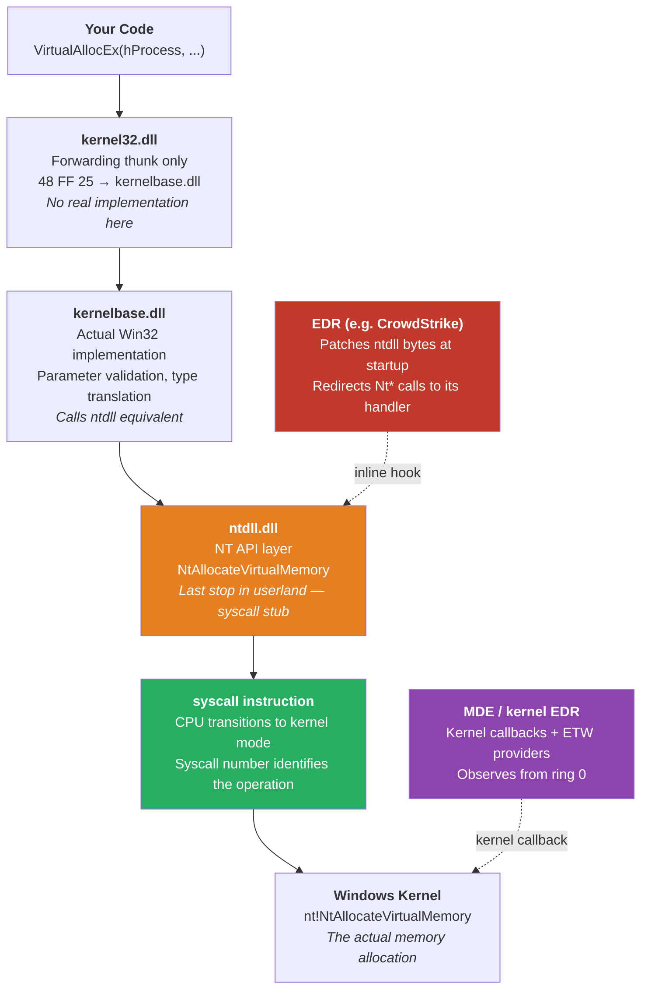

## Overview

Part 1 tested the static assumption: do the injection API imports alone trigger detection? The answer was no — ThreatCheck showed clean on a binary with all four injection imports and no payload.

This post tests the runtime assumption: when those API calls are actually made against a live process on an MDE-protected system, does detection fire? To answer that we first need to understand what the call chain actually looks like — where your code goes when it calls `VirtualAllocEx`, which DLL layers it passes through, and where different EDRs sit in that path.

**What this post covers:**
- The four-layer Windows API model: Win32 → kernelbase → NT API → syscall
- What forwarding thunks are and why kernel32 is mostly just jump tables
- How userland ntdll hooks work and why MDE uses a different approach
- What MDE actually hooks in practice — and why it is not what most people expect
- A live injection test against MDE: what fires and what does not

---

## The Layered API Model

Windows API calls do not go directly to the kernel. They pass through a stack of DLL layers, each with a different role:



The layers:

| Layer | DLL | What it does |
|---|---|---|
| Win32 forwarding | `kernel32.dll` | Mostly forwarding thunks (`48 FF 25`) into kernelbase — no real code |
| Win32 implementation | `kernelbase.dll` | Actual parameter validation and translation; calls ntdll |
| NT API | `ntdll.dll` | Thin syscall stubs — loads SSN and executes `syscall` |
| Kernel | `ntoskrnl.exe` | The real implementation, running in ring 0 |

> **`kernel32.dll` is mostly a thunk layer.** Since Windows 7 the real Win32 implementations live in `kernelbase.dll`. `kernel32!VirtualAllocEx` is 7 bytes: `48 FF 25 XX XX XX XX` — a single `jmp [rip+offset]` into `kernelbase!VirtualAllocEx`. This matters for hook detection: checking `kernel32.dll` only tells you about the thunk, not the real function.

Some EDRs hook at the **ntdll layer** — the last userland stop before the kernel. Others operate entirely in kernel mode. Understanding the difference matters, because the technique used against one approach has no effect on the other.

---

## The ntdll Syscall Stub

`ntdll.dll` is the lowest userland DLL. Every Nt* function in it follows an identical pattern — a short stub that loads a hardcoded syscall number into `eax` and then executes the `syscall` instruction to drop to the kernel.

Here is `NtAllocateVirtualMemory` on a clean system (no EDR):

```
ntdll!NtAllocateVirtualMemory:
  4C 8B D1          mov r10, rcx       ; copy arg1 to r10 (syscall calling convention)
  B8 18 00 00 00    mov eax, 0x18      ; load SSN (Syscall Service Number)
  0F 05             syscall            ; transition to kernel mode
  C3                ret                ; return to caller
```

Only 11 bytes. No logic, no branching — it just loads a number and drops to the kernel. The `0x18` is the **Syscall Service Number (SSN)**: an index into the kernel's System Service Descriptor Table (SSDT) that maps to the actual kernel function.

The byte pattern for a clean ntdll stub is always:

```
4C 8B D1  B8 XX XX 00 00  0F 05  C3
```

The `XX XX` bytes vary per function (that is the SSN). Everything else is identical across all Nt* stubs.

This predictability is exactly what makes hook detection possible — and exactly what EDRs exploit.

---

Some EDRs — CrowdStrike Falcon, SentinelOne, Carbon Black — address this by patching the first bytes of ntdll function stubs at process start, replacing the clean `4C 8B D1 B8` prologue with a JMP into their own handler. Every Nt* call then passes through the EDR before reaching the kernel, giving it full argument inspection and blocking capability. Techniques like direct syscalls and ntdll unhooking exist specifically to bypass this mechanism. MDE takes a different approach.

---

## Seeing It Live: What MDE Actually Hooks

Running HookDetector on a Windows 11 system with the **Microsoft Defender for Endpoint** sensor active produces a result that contradicts the common assumption:


The headline numbers:

```
[*] Total Functions Checked: 45
[!] HOOKED Functions: 6
[+] CLEAN Functions: 39
```

> **Tool limitation note:** HookDetector detects hooks by checking the first bytes of each function against the expected `4C 8B D1 B8` syscall stub pattern. For ntdll functions that are *not* syscall stubs — like `EtwEventWrite` and `LdrLoadDll`, which have full implementations — any non-matching prologue is reported as `SUSPICIOUS (Modified Syscall Stub)`. Similarly, `kernel32!CreateFileA/W` starting with `FF 25` are standard **forwarding thunks** to `kernelbase.dll`, not hooks. The tool cannot distinguish between a hooked complex function and a normal one using this method alone.

The reliable part of the output is the **syscall stub results** — those have a definitive expected pattern and the tool identifies deviations unambiguously. And those are all clean:

```
[CLEAN]  ntdll.dll!NtAllocateVirtualMemory   4C 8B D1 B8  ->  mov eax, 0x18
[CLEAN]  ntdll.dll!NtWriteVirtualMemory       4C 8B D1 B8  ->  mov eax, 0x3A
[CLEAN]  ntdll.dll!NtProtectVirtualMemory     4C 8B D1 B8  ->  mov eax, 0x50
[CLEAN]  ntdll.dll!NtCreateThreadEx           4C 8B D1 B8  ->  mov eax, 0xC9
[CLEAN]  ntdll.dll!NtCreateUserProcess        4C 8B D1 B8  ->  mov eax, 0xD1
```

**Every injection-relevant syscall stub is unmodified.** MDE has not patched the ntdll entry points for memory allocation, remote writes, or thread creation. There are no userland inline hooks on the injection API path.

### The Forwarding Thunk Pattern

The output also shows something worth understanding about `kernel32.dll` itself:

```
[CLEAN]  kernel32.dll!VirtualAllocEx
         Bytes: 48 FF 25 E1 6C 04 00 CC CC CC CC CC CC CC CC CC

[CLEAN]  kernel32.dll!WriteProcessMemory
         Bytes: 48 FF 25 19 96 04 00 CC CC CC CC CC CC CC CC CC
```

These start with `48 FF 25` — `jmp QWORD PTR [rip+offset]`. These are not hooks. They are the standard **forwarding thunks** that every `kernel32.dll` export has used since Windows 7. The bytes jump into `kernelbase.dll` where the actual implementation lives. `kernel32.dll` is essentially a compatibility shim — it exports the same names for backward compatibility but contains no real code.

---

### What Different EDRs Hook

MDE's kernel-first approach is not universal. Products that rely more heavily on userland hooks show a very different picture:

| Function | MDE | CrowdStrike / SentinelOne (typical) |
|---|---|---|
| `NtAllocateVirtualMemory` | **Clean** — kernel callback | Hooked (E9 JMP) |
| `NtWriteVirtualMemory` | **Clean** — kernel callback | Hooked (E9 JMP) |
| `NtCreateThreadEx` | **Clean** — kernel callback | Hooked (E9 JMP) |
| `EtwEventWrite` | **Hooked** — protect telemetry | Sometimes hooked |
| `LdrLoadDll` | **Hooked** — DLL load monitoring | Hooked |
| `CreateFileA/W` | **Hooked** — on-access scan | Varies |

Unhooking ntdll removes the userland hooks from the second column. Against MDE, there is nothing to unhook for the injection APIs — because MDE was never watching there.

---

## What This Means for an Injector

Return to the four-step injector from Part 1:

```
VirtualAllocEx WriteProcessMemory CreateRemoteThread
```

Each of those kernel32 functions calls through kernelbase into an ntdll equivalent:

| kernel32 | kernelbase | ntdll | MDE watches via |
|---|---|---|---|
| `VirtualAllocEx` | `VirtualAllocEx` | `NtAllocateVirtualMemory` | Kernel callback |
| `WriteProcessMemory` | `WriteProcessMemory` | `NtWriteVirtualMemory` | Kernel callback |
| `CreateRemoteThread` | `CreateRemoteThread` | `NtCreateThreadEx` | Kernel callback |

The injector's every action is visible to MDE — but not because of ntdll hooks. The visibility comes from the kernel layer, where callbacks fire regardless of how the call was made: through kernel32, through a direct syscall, or through any other path.

The import table (Part 1) tells an analyst what the binary *intends* to do. The hook and callback infrastructure tells the EDR what it *is doing*, live. These are separate detection mechanisms requiring different responses.

The practical implication: for products that use userland ntdll hooks, removing those hooks eliminates their visibility into that call. For MDE, the ntdll layer was never where it was looking.

---

## The Practical Proof

Analysing bytes in a tool is one thing. Running the injection is another.

BasicInjector was modified to remove shellcode entirely. Instead of allocating RWX memory and writing shellcode bytes, it:

1. Resolves `WinExec` from `kernel32.dll` at runtime using `GetProcAddress`
2. Allocates `PAGE_READWRITE` (not RWX) memory in the target process — just enough for the string `"calc.exe\0"`
3. Writes that string with `WriteProcessMemory`
4. Calls `CreateRemoteThread` with `WinExec` as the start address and the string pointer as the parameter

No shellcode. No executable memory. No known byte signatures.

ThreatCheck on the binary before running:

```
[+] No threat found!
[*] Run time: 0.1s
```

Running against notepad.exe on the MDE-protected system:

```
PS C:\> .\BasicInjector.exe
[*] WinExec @ 0x7FFA92990790
[*] Target PID: 11340
[*] String allocated at 0x1EE738A0000
[*] Wrote 9 bytes
[+] Remote thread created — WinExec("calc.exe") running in notepad
```


Calc opened. MDE did not alert.

The complete four-step injection sequence — `OpenProcess`, `VirtualAllocEx`, `WriteProcessMemory`, `CreateRemoteThread` — completed on an MDE-protected system with no userland hooks intercepting any call and no static signature to trigger the scanner.

**This is a foundational result, not a bypass.** The injection was benign: no shellcode, no payload, no network connection, no credential access. MDE’s kernel callbacks received the thread creation event — it was not invisible. What kept the alert from firing was the absence of any malicious behaviour following the injection. A real implant executing stage-2 code, beaconing to a C2, reading LSASS, or moving laterally would generate a cascade of kernel-level events that MDE’s behavioural model would detect — not because of the API calls themselves, but because of what they collectively accomplish.

The point is that **the API calls are not the tripwire**. MDE does not maintain a simple list of banned function calls. Detection is contextual and behavioural, built from kernel telemetry that accumulates over the lifetime of the operation. Understanding that is what makes the techniques in the rest of this series meaningful: each one targets a specific layer, and knowing which layer is actually relevant changes which technique matters.

---

## What Comes Next

Dynamic API resolution (Part 3) removes the import table entries — solving the static analysis problem from Part 1. It does not remove hooks from ntdll (the hooks are in the mapped DLL, not in your binary), and it does nothing about kernel-mode callbacks.

Direct syscalls (Part 4) bypass userland ntdll hooks entirely by issuing the `syscall` instruction directly, without going through ntdll at all. Against products that rely on ntdll inline hooks, this removes a significant detection surface. Against MDE, the kernel callbacks still fire.

Each technique addresses a specific layer. This post mapped those layers. The rest of the series works through them one at a time.

- **[API Series Part 3: Dynamic API Resolution — PEB Walk and Custom GetProcAddress](/posts/api-series-dynamic-resolution/)** *(coming soon)*

---

## References

- [Windows Syscall Internals — j00ru syscall table](https://j00ru.vexillium.org/syscalls/nt/64/)
- [NtAllocateVirtualMemory — MSDN](https://learn.microsoft.com/en-us/windows-hardware/drivers/ddi/ntifs/nf-ntifs-ntallocatevirtualmemory)
- [Userland Hooking — modexp.wordpress.com](https://modexp.wordpress.com/2019/06/15/hook-injection/)
- [MITRE ATT&CK T1055 — Process Injection](https://attack.mitre.org/techniques/T1055/)
- [PE Format — Microsoft Learn](https://learn.microsoft.com/en-us/windows/win32/debug/pe-format)

**Related posts:**
- [API Series Part 1: Do Your API Imports Get You Caught? Testing the Static Assumption](/posts/api-series-static-detection/)
- [AMSI Internals Part 1: The Full Scan Pipeline](/posts/amsi-internals-scan-pipeline/)
